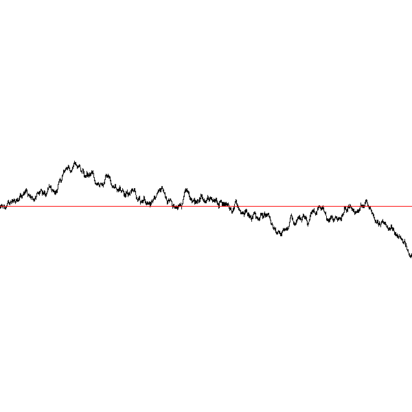
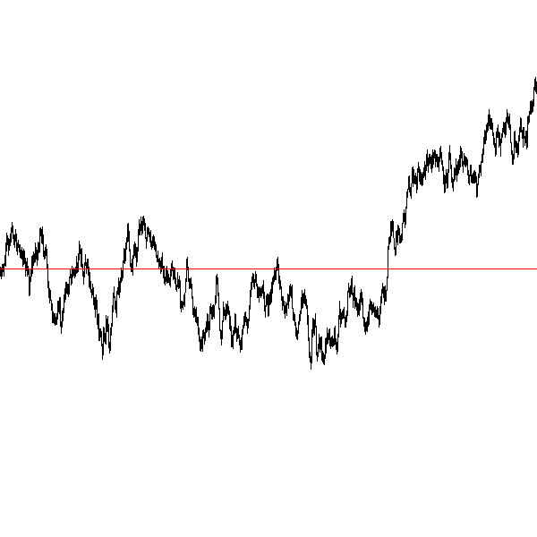

An Introduction to Computer Science and Programming with Python
===============================================================
Ed Harcourt <edharcourt@stlawu.edu>
v0.1, May 2017:
:toc: right
:numbered:
:numbered:
:icons: font
:source-highlighter: pygments
:stem: latexmath
:imagesdir: ./images
:includedir: .
:docinfo:

////
http://www.petercollingridge.co.uk/pygame-physics-simulation/collisions
http://www.petercollingridge.co.uk/book/export/html/6
http://www.petercollingridge.co.uk/book
https://stackoverflow.com/questions/101268/hidden-features-of-python/1024693

////

[preface]
== Preface

I have been teaching the _Introduction to Computer Programming_ course at St. Lawrence University since 2003. The course at St. Lawrence is the first course in the Computer Science major sequence it is also designed to satisfy a general education requirement called _Quantitaive and Logical Reasoning_. As such, it assumes no prior programming  experience, and students from across campus in a variety of disciplines take this course. These notes reflect the topics and content I have been teaching the past several years and are meant to be a companion for my lectures. For the time being these notes do not hold together as a standalone resource for learning programming in Python, though that is my ultimate goal. These notes are by no means complete with regards to the Python language. If you happen upon these notes outside of my course and you find them useful I would appreciate hearing about it. 

Goals of the course include:

* Appreciate the complexity of the software systems we encounter every day
* Emphasize problem soving in a precise, logical framework 
* Explore a multitude of topics in computer science such as; graphics and animation, image processing, simulation and randomness, cryptography, network communications, and much more.

== Introduction

_Computer Science_ is the field of study encompassing the theory and practical implementation of processing digital information. It includes such diverse areas networking, cryptography, security, web development, artificial intelligence, databases, computer graphics, mobile computing ... a list that could continue for some time. What this has enabled is astonishing; self driving cars, social media, voice and image recognition, digital music and video streaming (_e.g.,_ Spotify and Netflix), online shopping and banking, digital maps and GPS. Biologists use software to analyze DNA, Doctors use software to understand how genes impact disease.  Pharmacolgists search for new drugs using software. Computer programming and software is the thread that knits all of these together. It is where any introduction to computer science begins.

A _computer program_ (_i.e.,_ software) is developed and written in a _programming language_. There are, literally, thousands of programming languages, mostly dead now, https://en.wikipedia.org/wiki/List_of_programming_languages[but there are many hundreds still in active use].footnote:[Back in my college days some of the languages I learned were COBOL, Ada, Pascal, Prolog, SNOBOL, Lisp, Fortran, and APL. A veritable graveyard of languages. Lisp and Fortran have both lived on in some evolved form and have also had a profound impact on the design of many other languages languages still used today.] About a dozen languages dominate the modern software development landscape, and many more are actively used in niche areas such as engineering and the visual arts.  

The https://developer.mozilla.org/en-US/docs/Web/JavaScript[Javascript programming language] (not to be confused with the https://www.oracle.com/java/index.html[Java programming language]) is part of every web browser and just about every web site makes use of Javascript in some way. Most computer games are written in https://en.wikipedia.org/wiki/The_C_Programming_Language[C] or https://en.wikipedia.org/wiki/C%2B%2B[C++]. Native iPhone apps are written in https://developer.apple.com/library/content/documentation/Cocoa/Conceptual/ProgrammingWithObjectiveC/Introduction/Introduction.html[Objective-C] or https://developer.apple.com/swift/[Swift], while native Android apps use  https://developer.android.com/studio/index.html[Google's version of Java]. Statisticians and data scientists frequently use https://www.r-project.org/[R]. Scientists and engineers are partial towards https://www.mathworks.com/[MATLAB] or https://www.wolfram.com/mathematica/[Mathematica]. https://processing.org/[Processing] is a special purpose language for the visual arts. https://en.wikipedia.org/wiki/Verilog[Verilog] and https://en.wikipedia.org/wiki/VHDL[VHDL] are well established languages for designing electronic circuits. This list could go on. The https://www.tiobe.com/tiobe-index/[TIOBE Index] attempts to measure programming language popularity.

NOTE: A _programming language_ is precise notation used for describing computations to be carried out by a computing device (_e.g.,_ a computer, smartphone, tablet, etc.). Like a natural language such as English or German, a programming language has an alphabet, words, grammar (syntax), and meaning (semantics).

=== Software is taking over 
Almost every aspect of our daily life is impacted by software. Think about each of the following and what has changed and if there is software behind that change.

* How often do you go into a bank and interact with a teller? What do you use instead?

* What has happened to book stores, from your local book store to large chain stores such as Barnes and Noble and Borders? 

* When was the last time you used a travel agent to purchase an airline ticket?

* What has happened to DVD stores such as Blockbuster?

* What is disrupting the hotel and taxi industry?

* What has happened to music stores where we used to purchase albums and CDs?

* When was the last time you took a roll of film to get developed?

* When was the last time you wrote a letter and mailed it using the post office?

* Your smart phone is a powerful computing device, how often do you look at in a day, and what do you use it for?

* Thinking a little further in to the future what could happen to the millions of people who drive for a living, from taxi drivers to truck drivers? 

=== Hello World

https://www.python.org/[Python] is a popular programming language used widely in industry and academia. It is used for everything from web programming, scientific computing, data science, to developing games.  And much more. It is also used in introductory programming courses because it is relatively easy to use and get started with.  So lets get started.

It is almost obligatory that https://en.wikipedia.org/wiki/%22Hello,_World!%22_program[Hello World] be the first program one writes in any programming language. Here is our first python program:

[source,python,numbered]
----
print("Hello world")
----

That is it, just the one line. And it does as you might expect, it prints the message `Hello World` on the _console_. But there is a lot going on in that one line, so lets break it down. 

NOTE: The _console_ is a text window where python sends the output of `print` statements and where the user can also enter data from `input` statements. 

The python _builtin function_ `print` prints, to the console, the value between the parentheses. In this case the value being printed is the _string literal_ `"Hello World"`.  A string literal in python is a sequence of characters between double quotes or single quotes. More on string literals later.

NOTE: In programming, a string literal is also called _string constant_

The `print` function can take multiple values separated by commas.

[source,python,numbered]
----
print("The value of pi squared is", 3.14159 * 3.14159)
----
produces the output 

[source]
----
The value of pi squared is 9.869587728099999
----

And we can see right here that `*` is a character in the alphabet, that two values are on both sides of the `*` (syntax), and that `*` must mean _multiplication_ (semantics).

NOTE: In mathematics a _function_ maps values in a _domain_ to values in a _range_. For example, the function stem:[f(x) = x^2] maps the input 2 to the output 4, 3 to 9,  1.5 to 2.25, etc. 

Pictorially we can think of a function as a black box (we may not know how it works) where values come in (represented by the arrow coming in on the left) and the function produces values (the return results represented by the arrow coming out of the box on the right).  

image::function-fx.png[align="center"]

Values that are passed to a function are called _arguments_. The second argument in the call to the `print` function above is the mathematical expression `3.14159 * 3.14159`. In just about every programming lananguage the asterisk character `*` represents multiplication. A value such as `3.14159` in mathematics is called a _real number_ (a number with a decimal point). For reasons I wont go into now, in computer science and programming we call them _floating-point_ numbers, or _floats_ for short.

There is a big difference between the string literal `"3.0"` and the floating-point literal `3.0`. 

.What would get printed by the following print statement?
[source,python,numbered]
----
print("3.0 * 3.0", 3.0 * 3.0)
----

[.result]
====
[source]
----
3.0 * 3.0 9.0
----
====

Numbers without decimal points are called _integers_ or _ints_ for short. 

=== Integer and floating-point literals

Valid _integer literals_ include numbers such as 0, 1, 2, ... and also negative integers -1, -2, -3, ...

IMPORTANT: Don't start an integer literal with a leading 0, such as 09. This is an error in Python.

Floating-point literals include a decimal place, and include numbers such as 0.3, -0.3, .3, 3., -3.14159. 

Python (as do most programming languages) supports specifying numbers using _scientific notation_. For example, in Chemistry and Physics, Avagadro's number is stem:[6.022140857 \times 10^{23}]. Writing this out as `602214085700000000000000` is not very readable. In Python we can instead write Avagadro's number as `6.022140857e23`.

We can also use scientific notation for very small numbers.  The mass of an electron is stem:[9.10938356 \times 10^{-31}] kg.  Again, writing this as `0.000000000000000000000000000000910938356` is not helpful. We should instead write `9.10938356e-31`.

TIP: An integer (floating-point) literal is also called an _integer (floating-point) constant_.

.Example +++&nbsp;&nbsp;&nbsp;+++
The radius of an electron is _0.00000000000000281792_ meters. Express this number using Python's scientific notation.

[.result]
====
`2.81792e-15`  # meters
====

=== Variables

Let's return to our simple program ...

[source,python,numbered]
----
print("The value of pi squared is", 3.14159 * 3.14159)
----

It would be nice to give the value `3.14159` a name. An obvious choice being `pi`.  We do that in Python using an _assignment statement_.

[source,python,numbered]
----
pi = 3.14159
----
And we can rewrite our program as 

[source,python,numbered]
----
pi = 3.14159
print("The value of pi squared is", pi * pi)
----

To the left of the `=` sign is a _variable name_ and we read the assignment statement above as `pi` _gets the value of_ the value on the right of `=`, in this case `3.14159`.

Variable names in Python should be meaningful. We could have said

[source,python,numbered]
----
rumpelstiltskin = 3.14159
print("The value of pi squared is", rumpelstiltskin * rumpelstiltskin)
----

but this makes the code less understandable.

Variable names must start with either an alphabetic character (a - z, A - Z) or underscore, and may also contain digits. Variable names are also _case sensitive_, so `pi`, `Pi`, and `PI` are all different variable names.footnote:[In reality Python 3 is much more flexible on what characters can be used in variables names including Greek characters such as `α`,`β`,`γ`,`δ`,`Γ`,`Δ`. Maybe a better variable name than `pi` is `π`.]

The value on the right of `=` can also be an _expression_.

IMPORTANT: Students often confuse `=` with mathematical equality and think `3.14159 = pi` is the same thing as `pi = 3.14159`. The former is not valid Python.

[source,python,numbered]
----
pi = 3.14159
pi_squared = pi * pi
print("The value of pi squared is", pi_squared)
----

IMPORTANT: Variables must be defined before they are used.

The Python program 

[source,python,numbered]
----
print(x)
----

would produce an error becuse the variable `x` does not have a value.

IMPORTANT: Variable names are not string literals.

.There is a big difference between the two statements...
[source,python,numbered]
----
print("The value of pi squared is", pi_squared) # <1>
print("The value of pi squared is", "pi_squared") # <2>
----

[.result]
====
<1> prints `The value of pi squared is 9.869587728099999`
<2> prints `The value of pi squared is pi_squared` +
Almost certainly not what was intended.
====

=== Comments

We can add notes to our program using a _comment_. In Python a one line comment starts 
with a hashtag and continue to the end of the line.

[source,python,numbered]
----
# define a variable pi
pi = 3.14159
----

You can also use a comment to finish a line.

[source,python,numbered]
----
pi = 3.14159   # define a variable pi
----

=== Mathematical Expressions

The arithmetic operators we will be using most are:

[cols="1,8", width="50%", options="header"]
.Mathematical Operators
|===
|Operator | operation
|`+`
|addition
|`-`
|subtraction
|`*`
|multiplication
|`/`
|floating-point division
|`//`
|integer division
|`%`
|remainder (modulus)
|`**`
|exponentiation
|===

Python has many more operators, but this is all we will need for now.  You can combine these operations in complicated ways including using parentheses. The _normal 
order of operations_ you learned in grade school apply.

. parentheses
. exponention
. multiplication, division (include remainder)
. addition and subtraction

==== Examples

What is the output of each of the examples below?

.Example 1
[source,python,numbered]
----
x = 3 + 5 * 9
print(x)
----

[.result]
====
`48`
====

.Example 2
[source,python,numbered]
----
x = 1/2 <1>
print(x)
----

[.result]
====
`0.5`
====
<1> Recall that the single slash `/` is _floating-point division_, meaning the result is 
a floating-point number.

Contrast this with _integer division_ using the double slash operator `//`. 
In integer division the result is always an integer.

.Example 3
[source,python,numbered]
----
w = 1 // 2
x = 3 // 7
y = 3 // 2
z = 77 // 5
print(w,x,y,z)
----

[.result]
====
`0 0 1 15`
====
 
Integer division will plays a key role in many applications incomputer science.

.Example 4
[source,python,numbered]
----
x = 7
y = 9
z = x + y // 4 * x - 2 ** 3
print(z)
----

[.result]
====
`13`
====

Expressions produce a value. Something must be done with that value such as assign it to a variable or use it as an argument in a function call (such as `print`).  Consider the following Python program.

[source,python,numbered]
----
two_pi = 3.14159 * 2 <1>
two_pi * two_pi <2>  
print(two_pi) <3>
----
<1> compute 2&pi; and store the result in the variable `two_pi`
<2> multiply `two_pi` times `two_pi` _and do nothing with the result_ so Python just throws the value away. *This line is pointless*, it has no effect, but it is legal.
<3> print `two_pi`

=== Modular Arithmetic

_Modular arithmetic_ is important in computer science.  Modular arithmetic is just arithmetic that uses the remainder after finding a quotient. For example, `7 // 3` is `2` with a remainder of `1`. The remainder operator is `%`. In this case `7 % 3` is `1`.

.Check Yourself
[source,python,numbered]
----
# What gets printed by the following?
w = 1 % 2
x = 3 % 7
y = 3 % 2
z = 77 % 5
print(w,x,y,z)
----

[.result]
====
`1 3 1 2`
====

A couple of important properties to remember. If we are computing `n % m` and we know that `n` is less than `m` and they are both positive, then the result is always `n`. For example `278 % 455` is `278`.

TIP: In mathematics we sometimes refer to modular arithmetic as _clock arithmetic_. You perform modular arithmetic all the time, you just don't know it. For example, if it is 2PM and we wanted to figure out what time it will be 14 hours from now, we can compute `(2 + 14) % 12`, which is 4. So it would be 4AM.  

Computing the modulus of a negative number is also important, for example `-1 % 12`. Think of computing the modulus of a negative number as going _counter clockwise_ around the clock. For example, `-1 % 12` is `11`, and `-5 % 12` is `7`.  

`-14 % 12` would be to go counter clockwise one full revolution leaving s with `-2 % 12`, which is `10`. 

.Check Yourself
[source,python,numbered]
----
# What gets printed by the following?
w = -1 % 2
x = -3 % 7
y = -3 % 2
z = -77 % 5
print(w,x,y,z)
----

[.result]
====
`1 4 1 3`
====

TIP: We will see a use of computing the modulus of a negative number in cryptography.

=== More on String Literals

Strings are an important part of programming. Strings often seem boring but they are partof every piece of software and are often central to applications such web searching, texting, email, DNA sequence analysis, and cryptography.

A string literal is a sequence of characters between double quotes. 

[source,python,numbered]
"This is a valid string literal"

Or single quotes.

[source,python,numbered]
'and so is this'

IMPORTANT: the opening and closing quotes in a string literal must match

[source,python,numbered]
"but this string literal has an error, why?'

[source,python,numbered]
'and so does this, why?"

But what if we want to include a single quote as one of the characters in our string literal? One way to do it is to use double quotes for the string literal.

[source,python,numbered]
"This isn't an error"

This works becuase the outer double quotes demarcate the string literal and the single quote in `don't` is just a single quote character because it is inside the double quotes.

The following is incorrect.

[source]
'It isn't easy to see that this is an error, why?'

Python can't tell that the second single quote in `isn't` is part of the word but recognizes it as the closing quote matching the open quote.

.What would get printed by the following print statement?
[source,python,numbered]
----
print('He said "Do it!"') 
----

[.result]
====
`He said "Do it!"`
====

Things can get pretty crazy. How about if we wanted to print the string _He said "Don't do it!"_.  The issue here is that the string we are printing contains a mix of double and single quotes. The trick is that we need to _escape_ one of the quote characters. For example, if we need a single quote to be the single quote character and not the start or end of a string literal we can put a backslash character in front of it. 

The statement

[source,python,numbered]
print('He said "don\'t"') 

produces the output 

[source]
He said "don't"

=== A note about spaces

Spaces, like in writing, are used to separate words in Python, and are often used to make code more readable. For example, in a `print` statement you can put a space after the comma that is separating values to print.

[source,python,numbered]
print(a, b, c, d) 

which might look slightly less cramped than
 
[source,python,numbered]
print(a,b,c,d) 

Spaces can also make code less readable,

[source,python,numbered]
print(a      ,           b,c,                       d) 

is also valid -- but ugly.

WARNING: Spacing at the start of a line that changes indentation can cause problems. See the next section.

=== A note about indentation

We will see later on that indentation plays an important role in Python. For now you should just note that all python statements that are _at the same level_ (and we wont really know what that means until we get to more complicated Python) should be indented exactly the same. 

Here is an example. The following program is in error because the second statement is indented one space.

[source,python,numbered]
x = 4
 print(x*x)

TIP: Python is unique in the way that it treats indentation. Most other programming languages are not sensitive to the way that indentation is handled.

=== Syntax Errors

We've already encountered ways in which we can violate the rules of the language. In computer programming we call these _syntax errors_. 

NOTE: A _syntax error_ is an error that violates the rules of the language. Syntax errors
can be detected _before_ the program executes. 

Find the error in each of the following:

.Example 1
----
print("Hello)
----

[.result]
====
Missing double quote closing the string lteral `"Hello"`.
====

.Example 2
----
print("Hello')
----

[.result]
====
Mismatched quotes.
====

.Example 3
----
print("Hello"
----

[.result]
====
Missing closing parentheses.
====

.Example 4
----
print("Hello" 77)
----

[.result]
====
Missing comma between `Hello` and `77`.
====

.Example 5
----
print(x)
----

[.result]
====
Variable `x` is not defined.
====

.Example 6
----
 x = 5
print(x)
----

[.result]
====
Indentation error
====

.Example 7
----
x = 5 9
print(x)
----

[.result]
====
Python expects there to be something _between_ the `5` and the `9` such as a mathematical operator `+` or `*`.
====

.Example 8
----
5 = x
print(x)
----

[.result]
====
Python expects there to be something a variable to the left of `=`.
====

.Example 9
----
x = 8 @ 7
print(x)
----

[.result]
====
Python does not have an operator named `@`.
====

Some syntax errors are just nasty and difficult to find. The following one line program looks like it should be a syntax error non-sensical but shows a common mistake of leaving off the parentheses when calling a function. But the program actually runs.

.Example 8
----
print
----

[.result]
====
<built-in function print>
====

As you gain practice you will be able to quickly find syntax errors.

=== Keyboard Input

Python's `input` function allows the user to enter input from the keyboard. It takes a string as an argument and uses it as a prompt. The `input` function is a different kind of function than the `print` function. The `print` puts values on the Python console window whereas the `input` function produces a string value of the characters that the user typed.

[source,python,numbered]
name = input('Enter your name: ')
print("Hello", name)

 Enter your name: Hermione <1>
 Hello Hermione
 
<1> `Hermione` is what the user typed and then hit _enter_ on the keyboard.
 
It is common to have users enter numbers and then use the values in mathematical expressions. The formula to convert a temperature in fahrenheit to celsius is 
latexmath:[5/9(f-32)]

[source,python,numbered]
f = input('Enter a temperature (F): ')
c = 5/9*(f - 32)
print(f, "fahrenheit is", c, "celsius")

Unfortunately `f` contains a string, not a number, and `(f - 32)` has an error because you can't subtract 32 from a string. You need to first convert `f` to either 
an integer or a floating-point number using either the `int` or `float` function.

WARNING: The `input` function returns a string value, even if the user entered a number. You must convert the string to a number using the `int` or `float` function if you intend to use the input in a mathematical expression.

.The `int` function

The function `int` takes a string argument and attempts to convert it to an integer and return the resulting integer. For example `int("-36")` would return the integer `-36`. The `int` function is also used to convert a floating-point number to an integer by truncating the decimal point. For example `int(3.14159)` would return `3`. Sometimes `int` can result in a _run-time error_. For example `int("3.14159")` causes an error because the string cannot converted to an integer. What about `int('hello')`?

NOTE: A _run time error_ is an error that can only be detected when the program executes and not before. A run-time error is often called a _crash_. You'll often hear programmers say "The programming is crashing" or "the program crashes on this line of code".

.The `float` function
NOTE: The function `float` takes a string argument and attempts to convert it to a floating-point number and return the resulting float. For example `int("-3.14")` would return the float `-3.14`. The `float` function is also used to convert an integer to a float. For example `float(3)` is `3.0`. Similar to `int` if the argument cannot be converted then a run-time error will result. For example `float('hello')`.

Here is our modified program

[source,python,numbered]
f = float(input('Enter a temperature (F): ')) <1>
c = 5/9*(f - 32)
print(f, "degrees fahrenheit is", c, "degrees celsius")

<1> Notice the use of the function `float` to convert the string to a floating-point number. 

Here is a sample run of the Fahrenheit to Celsius conversion program.

 Enter a temperature (F): 83.5 <1>
 83.5 degrees fahrenheit is 28.61111111111111 degrees celsius

<1> The user entered `83.5`

Notice the rather unhelpful number of digits in the result `28.61111111111111`. It looks rediculous. Python has a builtin function `round` that rounds a floating-point number to a certain number of decimal places. For example, `round(3.157, 2)` will round `3.157` to two decimal places, producing the value `3.16`. Using this in our temperature conversion program:

[source,python,numbered]
f = float(input('Enter a temperature (F): '))
c = 5/9*(f - 32)
print(f, "degrees fahrenheit is", round(c,1), "degrees celsius") <1>

<1> Notice the use of the function `round` to round th value `c` to one decimal places.

Here is a sample run of the Fahrenheit to Celsius conversion program.

 Enter a temperature (F): 83.5
 83.5 degrees fahrenheit is 28.6 degrees celsius
 
NOTE: There are two different kinds of functions in Python, those that _return_ values, and those that do not return a value but peform some other side effect. `print` is an example of a function that does not return a value but has the the side effect of printing to the console window. Contrast this to the `round` function which returns a rounded result.

image::round.png[align="center"]

==== Program Flow

Python programs execute line-by-line top-to-bottom. Variables must be defined and assigned 
values before those values can be used. Consider the previous celsius-to-fahrenheit conversion program. 

. The first assignment statement +
`f = float(input('Enter a temperature (F): '))` +
that executes defines the variable `f`. +
. The second statement +
`c = 5/9*(f - 32)` +
defines `c` _by using_ the variable `f`
. The third statement +
`print(f, "degrees fahrenheit is", round(c,1), "degrees celsius")` <1> +
prints the result using both `c` and `f`

=== The `math` module
 
Python has lots of support libraries that we can use to get our work done. Think of 
a support library as predefined functions that you can call on. One such support library is called the _math module_. The math module contains lots of functions and some predefined constants. For example `math.sin(x)` computes the _sin_ of the argument stem:[x] (where stem:[x] is in radians).   

NOTE: A _module_ is a named collection of related frunctions and definitions. Modules can be hierarchical, that is we can have modules defined inside other modules. Much like on your computer where you can have folders inside folders to organize your documents.

To use the functions and definitions in the math module your program first needs to tell Python that we need it using an _import statement_.

[source,python,numbered]
----
import math
----

One way to compute the square root of a number would be just to raise to the 1/2 power. 

[source,pyhon]
----
print(2**.5)
----

Another way would be to use the math module's square root function.

[source,python,numbered]
----
print(math.sqrt(2))
----

TIP: `import` is a Python _keyword_. A keyword is a word reserved for use by Python. 
As such you should never use a keyword as a variable name (in fact that is an error). 

A constant defined in the math module is `math.pi`

[source,python,numbered]
----
print(math.pi)
----

[source,console]
----
3.141592653589793
----

NOTE: To reference functions and definitions in a module use _dot notation_. For example, `math.pi`, `math.sqrt(x)`.

==== Function Composition

A powerful programming technique is to call a function and use its return result as an argument in another function call. This is called _function composition_. Mathematically if stem:[f] and stem:[g] are functions that return a result we can _compose_ them as stem:[f(g(x))]. 

For example, if we needed to compute stem:[sin(\sqrt{\pi/4})] ...

image::function-composition.png[align="center"]

.Version 1
[source,python,numbered]
----
result = math.sin(math.sqrt(math.pi/4)) <1>
print(round(result, 2)) <2>
----
<1> This is the function composition of `math.sin` and `math.sqrt`.
<2> Here we are composing `print` and `round`

We could have done all this in one (albeit less readable) line ...

.Version 2
[source,python,numbered]
----
print(round(math.sin(math.sqrt(math.pi/4)), 2))
----

Or we could have also broken it up into more statements ...

.Version 3
[source,python,numbered]
----
result1 = math.sqrt(math.pi/4)
result2 = math.sin(result1)
result3 = round(result2, 2) 
print(result3)
----

These are all equivalent and one is not necessarily better than the other. A fourth version reuses the `result` variable in each statement and does not define new variables.

.Version 4
[source,python,numbered]
----
result = math.sqrt(math.pi/4)
result = math.sin(result)
result = round(result, 2) 
print(result)
----

We will see over and over that there are many ways to express the same computation, some may be better than others because they are more readable or more efficient.

https://docs.python.org/3/library/math.html[Python math module documentation]
 
=== Kinds of Program Errors

We have already discussed _syntax errors_ and _run time errors_. 

Recall that a syntax error is an error in how you string together the words and characters of your program. For example, a missing parentheses, or quote in a string literal, etc.  Syntax errors can be detected _before_ you run the program and are often highlighted in whatever IDE.footnote:[Integrated Development Environment. An IDE integrates into one tool an editor in which you edit, run,and debug your Python programs.] you are using. 

A _run-time_ error are errors that cannot be detected before program execution and only occur while your program is executing. Common run-time errors include divding by zero, or using a variable before it is defined. For example, consider the following simple (and silly) program:

[source,python,numbered]
----
s = int(input("Enter a number: "))
print("1000 divided by", s, "is", 1000/s) 
----

What would happen if the user entered a 0 at the input prompt? There is no way for python to know what the user is going to type and if they enter a 0 then the program will _crash_.

==== Logic Errors
There are even more insidious and difficult to find errors. At least with a syntax error the IDE will tell you where in the code the error is, and when you have a run-time error python will tell you exactly which line caused the crash. 

Lets revisit our celsius to fahrenheit conversion program.  The program below does not contain a syntax error nor does it contain a run-time error. There is, however, a problem with it. Can you see it?

.Logic error
[source,python,numbered]
----
f = float(input('Enter a temperature (F): '))
c = 5/9 * f-32
print(f, "degrees fahrenheit is", round(c,1), "degrees celsius")
----

[.result]
====
There are parentheses missing around the `f-32`. This program executes just fine and produces a result, it is just the wrong result. This kind of error is a _logic error_. A logic error is an error where the program produces an incorrect result when it executes. 
====

=== Bits, CPUs, Interpreters, and Compilers

Place holder to talk about computers, ...

=== Exercises

.C2F 
Write a program that converts a temperature in celsius to fahrenheit. Prompt the user for the temperature and print the conversion rounded to two decimal places.  Make the output 
neat and descriptive.

.Windchill
Write a Python program that calculates the wind chill temperature stem:[W] given the current temperature stem:[t] (in Fahrenheit) and the wind velocity stem:[v] (in MPH). The current temperature and the wind velocity should be entered by the user from the keyboard. +
The https://www.weather.gov/media/epz/wxcalc/windChill.pdf[formula the National Weather Service uses] to calculate wind chill temperature is:

stem:[W = 35.74 + 0.6215t + (0.4275t - 35.75)v^{0.16}]

 Enter temperature (F): 32.0
 Enter wind velocity (MPH): 10.0

 The wind chill for 32.0 degrees with a
 wind velocity of 10.0 MPH is 23.7 degrees.

Print the result rounded to one decimal place, like the `23.7` above.

.Area of circle
The area of a circle with radius stem:[r] is stem:[area = \pi r^2].  Write a program that prompts the user for a radius and computes and computes and prints the area of the circle rounded to 3 decimal places.

.Volume of a Cone
The volume of a cone with height stem:[h] and radius stem:[r] is stem:[v = \pi r^2h/3]. Write a Python program that will read the radius and the height from the user and computes and prints the volume of the cone.

.Population Growth
In the United States there is a birth every 8 seconds, a death every 12 seconds, and a new immigrant (net) every 33 seconds.  The current population is roughly 325 million. Write a program that will promt the user for a number of years and print the estimated population that many years from now.

.Compound Interest
Assume that *_C_* is an initial amount of an investment, *_r_* is the yearly rate of interest (e.g., .02 is 2%), *_t_* is the number of years until maturation, *_n_* is the number of times the interest is compounded per year, then the final value of the investment is stem:[p=c(1+r/n)^{tn}]. Write a program that reads *_C_*, *_r_*, *_n_*, and *_t_* from the user and computes and then prints the final value of the investment to the nearest penny.

.Change Making 
Write a prgram that reads an amount of money that we need to make change for, and dispenses
the correct amount of change (in U.S. currency). Assume that the 20 dollar bill is the largest denomination.  Here is an example execution of the program ...

----
Enter an amount to make change for: 78.98

Your change is...

3 twenties
1 ten
1 five
3 ones
3 quarters
2 dimes
0 nickels
3 pennies

---- 

.Distance from origin
The distance of a point stem:[(x,y)] from the origin, by the Pythagorean theorem is stem:[d=\sqrt{x^2+y^2}]. Write a program that reads an stem:[x] and a stem:[y] from the user and computes the distance of the point from the origin.

.Distance between two points
The distance _between_ two points _(x~1~,y~1~)_ and _(x~2~,y~2~)_ is also easily derived usingthe Pythagorean theorem. It is stem:[d=\sqrt{(x_2-x_1)^2 + (y_2-y_1)^2}]. Write a program that reads two points from the user and computes and prints the distance between the two points.

'''

=== Terminology

Every discipline has its own terminology (or _nomenclature_). Terminology is what allows us to _communicate intelligently with accuracy and precision_ about a discipline both amongst other programmers and to the lay-person. 

TIP: Master the terminology. Every term below is defined somewhere in this text. Just search for it in the browser.

.Terminology
[cols="2"]
|===

a| 
* computer science
* string literal (constant)
* integer literal (constant)
* floating-point literal (constant)
* builtin function
* function call
* variable
* _Hello World_ program
* scientific notation
* programming language
* comment
* crash
* prompt
* CPU
* interpreter
* domain (of a function)

a|
* argument
* expression
* value
* syntax error
* run-time error
* function
* keyword
* module
* escape character
* assignment statement
* function composition
* logic error
* bit
* compiler
* range (of a function)
* console

|===

.Functions

We have encountered several functions this chapter.

* `print(arg1, arg2, ...)` +
+
`print` does not produce a value but has the side effect of printing the values `arg1`, `arg2`, ... to the console.
+
* `round(v, n)` -> `float` 
+
`round` expects a float to that will be rounded to `n` decimal places. The rounded float is returned.
+
* `math.sqrt(v : float)` +
+
`math.sqrt` in the math module computes and returns the square root of `v`.
+
* `int(x)`
+
If `x` is a float then return the integer part of `x` by truncating the decimal part. If `x` is a string then attempt to convert the string to an integer. If it can't then error.
* `float(x)`
If `x` is an integer then convert it to a float. If `x` is a string then attempt to convert it to a float. If it can't then error.
* `input(prompt)` + 
+
print the string `prompt` to the console and wait for keyboard input. Return the string the user entered. No type conversion takes place. For example if the user types 3.14 then the string "3.14" is returned.

== Pygame Intro

A fun way to learn to program is through graphics, images, and animation.  https://www.pygame.org/news[Pygame] is a popular python library (module) for implementing graphics in Python programs. As the name suggests, Pygame can used for programming computer games, but we can also use its graphics capabilities to explore programming in Python and various topics in computer science.

To use pygame there is some standard code we need at the start of every program (but only in programs that use pygame).

.hello_pygame.py
[source,python,numbered]
----
import pygame <1>
pygame.init() <2>
win = pygame.display.set_mode((600,600)) <3>
----

<1> import the pygame module
<2> Call a pygame function `init` that initializes pygame. The `init` function takes no arguments and does not return a value. The parentheses are necessary to indicate that this is a function call.
<3> Construct a window, 600 pixels wide and 600 pixels high. The `set_mode` function is part of the `display` module that is in the `pygame` module. Notice the double parentheses. The `set_mode` function takes one argument, but that argument needs to be a _tuple_ that represents the width and the height of the window in pixels. `set_mode` returns a _reference_ to the window. `win` is a variable that refers to a pygame _display surfce_.

When we run the program above a window will display on our monitor and then quickly vanish. The window disappears because the program finished. We probably don't want the window to disappear right away.

NOTE: A _tuple_ is an ordered pair (or triple, or quadruple, etc.). A tuple in python is two or more values wrapped up into using parentheses with the values separated by commas. For example the tuple `(200,300)` represents a single value with two integer components.

NOTE: A _pixel_, short for _picture element_, represents a single dot on the screen. A typical display has a _resolution_, which might be stem:[1024 \times 768] (1024 pixels wide by 768 pixels high) or stem:[1472 \times 1193].  A pixel has a physical dimension that depends on the size of the display.  The word _pixel_ is sometims abbreviated _px_.

NOTE: Most of the variables we have encountered so far have held integers or floats. The variable `win` above represents a _reference_ to a window. For now, think of a reference as being a variable that refers to a complex object such as a window.  
.`x` is primitive and `win` is _reference_ +
image:references.png[width=500,align="center"]

NOTE: An _object_ in python is a value (not unlike an integer or a float) that contains functions for accessing the data in the object. Functions associate with objects are called _methods_.

For example, the pygame window above has two methods `get_height()` and `get_width()` that return the height and width in pxiels of the window. Methods are always called using a _dot notation_ of the object name followed by the methods. FOr example `win.get_height()`.

.Waiting +++&nbsp;&nbsp;&nbsp;+++
Can you think of a way we might be able to pause the program to keep the window from disappearing until the user hits a key on the keyboard?

[.result]
====
The `input` function waits for the user to type something on the keyboard and hit enter.

.hello_pygame.py
[source,python,numbered]
----
import pygame 
pygame.init() 
win = pygame.display.set_mode((600,600)) 
dummy = input("Hit <enter> to quit.") <1>
----
<1> We don't need the `dummy` variable since we aren't going to use what the user typed. We could have just said ...

[source,python,numbered]
----
input("Hit <enter> to quit.")
----
====

=== Colors

Before we talk about drawing shapes on the window we need to know how to represent a color. A common color scheme is called RGB, short for Red-Green-Blue. In pygame a color is a triple of three values where (0,0,0) represents black all the way up to (255,255,255) which is white. There are roughly 16 million different colors we can represent. [red]*Red* is (255,0,0), [green]*green* is (0,255,0), and [blue]*blue* is (0,0,255). Yellow is red and green, so that would be (255,255,0).

NOTE: There are many online tools to help determine the RGB values for various colors. Most development environments have one too. Just do an internet search for RGB colors, or color picker.footnote:[A popular _Integerated Development Environmnet_ is https://www.jetbrains.com/pycharm/[Pycharm] from https://www.jetbrains.com[Jetbrains]. Pycharm has a builtin Color Picker. There is a free Ecommunity Edition of Pycharm or students and faculty can obtain a free license for the Professional version.  ]

One common thing many of our pygame programs will do is to define some colors. 

.color.py
[source,python,numbered]
----
# file color.py
red    = (255,0,0)
green  = (0,255,0)
blue   = (0,0,255)
yellow = (255,255,0)
white  = (255,255,255)
black  = (0,0,0)
aqua   = (0,255,255)
burntsienna = (138,54,15)
lightgray = (200,200,200)
----	

We will soon get tired of retyping these definitions in our pygame programs. One thing we can do is to place these color definitions in their own file and name is `color.py`.
We can then import `color.py` into our pygame program and voila! we have created our own python module named `color` and we can reuse our color definitions without having to retype them every time.

TIP: Put commonly used code in a separate file and import that file into each program that needs it. This allows you to reuse code rather than duplicate it. 

.hello_pygame.py
[source,python,numbered]
----
import color   # this is the color.py file we just wrote above
import pygame

pygame.init() 
width = 600
height = 500
win = pygame.display.set_mode((width,height)) <1> 
win.fill(color.burntsienna) <2>
pygame.display.update() <3>
input("Hit <enter> to quit.") <4>
----
<1> `win` (short for window) is a _display surface_ in pygame. We did not have to call it `win`. We could have called it any legal variable name.

<2> Our first pygame drawing command `win.fill` takes one argument that is an RGB color triple and fills the window with the color `burntsienna` from our color module.

<3> When pygame functions draw on the display the window is not actally updated until we call the pygame function `pygame.display.update()`. 

<4> Wait for the user to hit enter so the window doesn't disappear right away.

=== Shapes

In this section we are going to introduce how to draw a circle, ellipse, rectangel, line, and a single pixel on a surface.

==== Rectangle 

The pygame function `pygame.draw.rect` draws a rectangle on a surface and takes either three or four arguments.

NOTE: Pygame programs only ever have one display surface. We will se later on that our pygame programs may have multiple surfaces (such as an image) that we will render on a display surface.

+++
<code class="listingblock">
pygame.draw.rect(<i>surface</i>, <i>color</i>, <i>xywh</i>, <i>optional-line-width</i>)
</code>
+++

_surface_:: The surface we are going to draw the rectangle on. For now we will just use the display surface `win` that was constructed using the `set_mode` function.

_color_:: An RGB triple such as (0, 255, 255) or color.yellow (from our color module)

_xywh_:: A four tuple (quadruple) that represents the stem:[x] and stem:[y] coordinate of the upper left hand corner of the rectangle and the width stem:[w] and the height stem:[h] of the rectangle. All units are in pixels.

_optional-line-width_:: If this argment is left off then the rectangle is filled in with the specified color. If it is specified then it takes a width, in pixels, of the border of the rectangle. 

CAUTION: The upper left coordinate of the surface is the origin (0,0). 

.Example +++&nbsp;&nbsp;&nbsp;+++
Draw a yellow rectangle that is one third the width of the display surface and one third the height in the center of the display. Hint: draw this out on a sheet of paper. It is a little trickier than you think. Here is a diagram to get you started.

[.result]
====
[source,python,numbered]
----
import pygame, color

pygame.init()
width = 600   # display surface 600 pixels wide
height = 400  # display surface is 400 pixels high
win = pygame.display.set_mode((width,height))

win.fill(color.lightgray)

# set up some variable for the rectangle
r_width = width//3
r_height = height//3
r_x = width//2 - r_width//2
r_y = height//2 - r_height//2
pygame.draw.rect(win, color.yellow, (r_x,r_y,r_width,r_height))
pygame.display.update()

input("Hit <enter> when done")
----
====

image::pygame-rect-window.png[width=533,height=367,align="center"]

Notice the use of _integer division_ `//`. All of the pygame functions take integer arguments. Intuitively, when calculating dimensions or coordinates it doesn't mak sense to do this in fractions of a pixel. 

.Self Check

Assume we have a 600 X 400 pygame display.

.Top Left+++&nbsp;&nbsp;&nbsp;+++
What is the coordinate of the top left pixel in the pygame window?

[.result]
====
(0,0)
====

.Top Right+++&nbsp;&nbsp;&nbsp;+++
What is the coordinate of the top right pixel in the pygame window?

[.result]
====
(599,0)

Now,most likely what you said was (600,0). This is a common mistake, Remember
the window is 600 pixels wide and we are starting counting at 0. So the 600th pixel
is column 599. This mistake of being off by one, computer scientists quite literally call an _off by one error_.
====

.Bottom Left+++&nbsp;&nbsp;&nbsp;+++
What is the coordinate of the top right pixel in the pygame window?

[.result]
====
(0,399)
====

.Bottom Right+++&nbsp;&nbsp;&nbsp;+++
What is the coordinate of the top right pixel in the pygame window?

[.result]
====
(599,399)
====

.Proportional Graphics
Notice that our yellow square is _proportional_ and relative to the size of the main pygame display surface. That is, if we change the size of the main display surface the yellow square will resize accordingly. Most often this is the kind of graphics that we want and is one of the powerful features of doing graphics using geometric shapes. The name for this kind of graphics, using geometric shapes, is _vector graphics_.

TIP: Try and always use _proportional graphics_. In proportional graphics a shape is drawn relative to some enclosing shape. For example an eye would be drawn relative to a head, and a pupil would be drawn relative to the eye. If we were drawing a house, a door's dimensions would be relative to the house's dimensions.  

Constrast this with using _absolute dimensions_ and _absolute pixel coordinates_. For example, if we draw a yellow rectangle at coordinate (100,200) with a width of 300 px and a height of 200 px.

[source,python,numbered]
pygame.draw.rect(win, color.yellow, (100,200,300,200))

then this woould draw the same sized yellow rectangle in the same place no matter if our display was 400 X 400 or 1000 X 1000.  Worse yet if the display was 200 x 200 the yellow square would not even fit in the display. 

Graphics using individual pixels only called _raster graphics_.

==== Circle

The pygame function `pygame.draw.circle` draws a circle on a surface and takes either four or five arguments.

+++
<code class="listingblock">
pygame.draw.circle(<i>surface</i>, <i>color</i>, <i>xy</i>, radius, <i>optional-line-width</i>)
</code>
+++

_surface_:: The surface we are going to draw the rectangle on. 

_color_:: An RGB triple

_xy_:: A tuple that represents the stem:[x] and stem:[y] coordinate of the _center_ of the circle.

_optional-line-width_:: If this argment is left off then the circle is filled in with the specified color. If it is specified then it takes a width, in pixels, of the border of the circle.

Lets draw a dark gray circle centered in the upper left quadrant of the yellow sqaure. We will do this proportionally, making the diameter of the sircle 1/3 width of the quandrant. Calculating the `x` and `y` coordinates of the circle can be a little tricky. The width of the quadrant is `r_width//2`

The x coordinate of the circle is relative to `r_x`, the x coordinate of the yellow rectangle. Add in 1/2 the width of the quadrant you get
 
[source,python,numbered]
ul_c_x = r_x + r_width//4   # ul_c_x is short for upper left circle x coordinate

Similarly the y coordinate is 

[source,python,numbered]
ul_c_y = r_y + r_height // 4

Remember that the circle fcuntion requires the radius but the problem stated that the 
diameter of the circle is 1/3 the width of the quadrant. We know the width f the quadrant is `r_width//2` and 1/3 od that is `r_width//2//3` and a radius is still 1/2 of that, so we are left with

[source,python,numbered]
ul_c_radius = r_width// 2 // 3 // 2 # or r_width // 12 

Defining a new color `darkgray = (100,100,100)` in our color module and putting it all together we have 

[source,python,numbered]
ul_c_x = r_x + r_width // 4
ul_c_y = r_y + r_height // 4
ul_c_radius = r_width//2//3//2  # width of quadrant is r_width//2 then 1/3 of that
pygame.draw.circle(win, color.darkgray, (ul_c_x,ul_c_y), ul_c_radius)

And we should get something that looks like

image::upper-left-circle.png[width=300,height=200,align="center"]

.Exercise +++&nbsp;&nbsp;&nbsp;+++
Draw another dark gray circle with the same radius centered in the upper right quadrant of the yellow rectangle.

[.result]
====
The only thing that changes is the x coordinate. The y coordinate and the radius
of the upper right circle are the same as the y coordinate and readius f the upper left circle. One way to think about the x coordinate is that is 3/4 of the width of the rectangle. 

[source,python,numbered]
----
ur_c_x = r_x + 3*r_width//4
ur_c_y = r_y + r_height // 4    # same as upper left circle
ur_c_radius = r_width//2//3//2  # same as upper left circle
pygame.draw.circle(win, color.darkgray, (ur_c_x, ur_c_y), ur_c_radius)
----

image::upper-right-circle.png[width=300,height=200,align="center"]

====
 
.Complete program +++&nbsp;&nbsp;&nbsp;+++
Here is the complete program so far with the two circles in the rectangle.

[.result]
====
[source, python]
----
pygame.init()
width = 600   # display surface 600 pixels wide
height = 400  # display surface is 400 pixels high
win = pygame.display.set_mode((width,height))

win.fill(color.lightgray)

# set up some variable for the rectangle
r_width = width//3
r_height = height//3
r_x = width//2 - r_width//2
r_y = height//2 - r_height//2
pygame.draw.rect(win, color.yellow, (r_x,r_y,r_width,r_height))

ul_c_x = r_x + r_width // 4
ul_c_y = r_y + r_height // 4

# width of quadrant is r_width//2 then 1/3 of that is
# the diameter, then 1/2 of that for the radius
ul_c_radius = r_width//2//3//2  
pygame.draw.circle(win, color.darkgray, (ul_c_x,ul_c_y), ul_c_radius)

ur_c_x = r_x + 3 * r_width // 4
ur_c_y = r_y + r_height // 4
ur_c_radius = r_width//2//3//2  # width of quadrant is r_width//2 then 1/3 of that
pygame.draw.circle(win, color.darkgray, (ur_c_x,ur_c_y), ur_c_radius)

pygame.display.update()

input("Hit <enter> when done")
----
====
 
[WARNING]
====
Notice the line for calculatig the x-coordinate of the upper right circle

 ur_c_x = r_x + 3 * r_width // 4

where we specified that it three-fourths thw width of the rectangle. You might be tempted to write

 ur_c_x = r_x + 3 // 4 * r_width

Why is the incorrect? Because `3//4` is 0!
====
 
 
==== Ellipse

An ellipse is an oval shape with a width and a height. In graphics an ellipse is very similar to a rectangle. In fact the function to draw an ellipse is almost execatly the same as the function to draw a rectangle.  The one part of drawing an ellipse that takes
some getting used to it that the `(x,y)` coordinate of the ellipse is the `(x,y)` coordinate of the rectangle (or _bounding box_) that surrounds the ellipse.

image::ellipse.png[align="center"]

NOTE: The _bounding box_ is the rectangle that circumscribes a geometric shape such as an ellipse, circle, or polygon. 

+++
<code class="listingblock">
pygame.draw.ellipse(<i>surface</i>, <i>color</i>, <i>xywh</i>, <i>optional-line-width</i>)
</code>
+++

_surface_:: The surface we are going to draw the ellipse on.

_color_:: An RGB triple

_xywh_:: A four tuple (quadruple) that represents the stem:[x] and stem:[y] coordinate of the upper left hand corner _bounding box_, abd the widthstem:[w]and the heightstem:[h]of the ellipse.

_optional-line-width_:: same as rectangle and circle functions.

These are, in fact, the same arguments for drawing a rectangle.

Continuing our program from before lets draw a pink ellipse centered in the x axis, 3/4 the width of the rectangle and two-thirds of the way down the height of the rectangle. Add `pink = (255, 20, 147)` to our `color.py` module.

[source,python,numbered]
----
e_width = r_width // 2
e_height = r_height // 4
e_x = r_x + r_width // 2 - e_width // 2
e_y = r_y + 2 * r_height // 3
pygame.draw.ellipse(win, color.pink, (e_x,e_y,e_width,e_height))
----

Adding this code to our running example we should get something like ...

image::ellipse2.png[width=300,height=200,align="center"]

You have probably guessed by now that what is taking shape is a face, a Mr. or Mrs. Blockhead.

.Exercise +++&nbsp;&nbsp;&nbsp;+++
Use an ellipse to add a nose above the mouth. +
image:nose.png[width=300,height=200,align="center"]

[.result]
====
There are lots of ways to do this, but you need to make it relative to the head. 
[source,python,numbered]
----
n_width = r_width // 10  # 1/10th width of head
n_height = r_height // 4 # 1/4 height of head
n_x = r_x + r_width // 2 - n_width // 2  # centered horizontally
n_y = r_y + r_height // 2 - n_height//2  # centered vertically
pygame.draw.ellipse(win, color.blue, (n_x,n_y,n_width,n_height))
----
====

.Exercise +++&nbsp;&nbsp;&nbsp;+++
You can give the Blockhead a smil by drawing an ellipse over the top of the mouth shifted up slightly, and make it the same color as the background head. +
image:smile.png[width=300,height=200,align="center"]

[.result]
====
This is one line, drawing an ellipse shifted up, say 20% of the width of the mouth.
[source,python,numbered]
----
pygame.draw.ellipse(win, color.yellow, (e_x, e_y, e_width, e_height - .2*e_height))
----
====

.Exercise
Give the Blockhead pupils by drawing a circle or ellipse in each eye. Make sure it is proportional!

TIP: You can always check to see if you are making your shapes proportional if you change the dimensions of the pygame display at the start of the program and make sure the image resizes appropriately.

==== Lines

You can draw a line in pyagme using the function `pygame.draw.line`.

+++
<code class="listingblock">
pygame.draw.line(<i>surface</i>, <i>color</i>, <i>start-xy</i>, <i>end-xy</i>, <i>optional-line-width</i>)
</code>
+++

_surface_:: The surface we are going to drawing the line on.

_color_:: An RGB triple

_start-xy_:: The (x,y) coordinate of one endpoint of the line

_end-xy_:: The (x,y) coordinate of the other endpoint of the line

_optional-line-width_:: The width of the line in pixels

.Exercise  +++&nbsp;&nbsp;&nbsp;+++
Draw a cross through the left eye. +
image:eye-cross.png[width=300,height=200,align="center"]

[.result]
====
[source,python,numbered]
----
pygame.draw.line(win, color.white,
                 (ul_c_x, ul_c_y - ul_c_radius),
                 (ul_c_x, ul_c_y + ul_c_radius))

pygame.draw.line(win, color.white,
                 (ul_c_x - ul_c_radius, ul_c_y),
                 (ul_c_x + ul_c_radius, ul_c_y))
----
====

There are other pygame drawing functions that we will introdce as needed. You can make an astonishing number of drawing from rectangles, circles, ellipses, and lines. 

.Our Complete Blockhead +++&nbsp;&nbsp;&nbsp;+++
Variables have been renamed to be more meaningful. FOr example `ul_c_x` which stood for (_upper left circle x coordinate_) is now `left_eye_x` and so on.

[.result]
====
include::python/blockhead.py[]
====

.Exercise
Complete the Blockhead adding ears, hair, a hat. Make sure it stays proportional. 

==== Sample Blockheads

To give you some ideas here are some of the blockheads that have been turned in over the years as assignments.footnote:[Thank you to Angelica Munyao, Sam Emerson, Ethan Cox, Elsa Feck, Yuxi Zhang, and Jack Pattison for allowing me to use their Blockhead submissions.]

.Example 1 +++&nbsp;&nbsp;&nbsp;+++
+++&nbsp;&nbsp;&nbsp;+++

[.result]
====
image::sbh.png[width=300,height=200,align="center"]
====

.Example 2 +++&nbsp;&nbsp;&nbsp;+++
+++&nbsp;&nbsp;&nbsp;+++

[.result]
====
image::minion.png[width=300,height=200,align="center"]
====

.Example 3 +++&nbsp;&nbsp;&nbsp;+++
+++&nbsp;&nbsp;&nbsp;+++

[.result]
====
image::pumpkin.png[width=300,height=200,align="center"]
====

.Example 4 +++&nbsp;&nbsp;&nbsp;+++
+++&nbsp;&nbsp;&nbsp;+++

[.result]
====
image::spongebob.png[width=300,height=200,align="center"]
====

.Example 5 +++&nbsp;&nbsp;&nbsp;+++
+++&nbsp;&nbsp;&nbsp;+++

[.result]
====
image::grumpy.png[width=300,height=200,align="center"]
====

.Example 6 +++&nbsp;&nbsp;&nbsp;+++
+++&nbsp;&nbsp;&nbsp;+++

[.result]
====
image::doodlebug.png[width=300,height=200,align="center"]
====

=== Terminology

.Terminology
[cols="2"]
|===

a| 
* pixel
* reference
* display surface
* off-by-one error
* vector graphics
* object
* bounding box

a|
* tuple
* Integrated Development Environment (IDE)
* surface
* proportional graphics
* raster graphics
* method

|===

=== Functions

* `pygame.init`
* `pygame.display.set_mode`
* `surface.fill`
* `pygame.display.update`
* `pygame.draw.rect`
* `pygame.draw.circle`
* `pygame.draw.ellipse`
* `pygame.draw.line`
* `pygame.draw.arc`

== Functions 

Functions play a massively important role in programming. They encapsulate common computations and keep programmers from having to reinvent the wheel.

Recall that in mathematics a _function_ maps values in a _domain_ to values in a _range_. In Python the `math.sqrt` function maps 4 to 2, 9 to 3, and 2 to 1.4142135...  

.`math.sqrt` function
image::sqrt-func.png[width=604,height=226,align="cener"]

The round function maps `round(3.56,1)` to `3.6`. *_Functions return values_*. Always. But sometimes we don't care about the return value. In Python functions sometimes return the special value `None` which, which essentially means the function does not "really" return a value.footnote:[In other programming languages such as C and and Java these are called _void_ functions.]. For example, the `print` function returns the value `None` but has the _side effect_ of printing its arguments on the console.

.`print` function
image::print-func.png[width=604,height=226,align="cener"]

We saw earlier that 

[source,python,numbered]
----
print("Hello World")
----

will print _Hello World_ on the console, but `print` also returned the `None` value.

The following looks strange, but is legit, and almost certainly not what was intended.

[source,python,numbered]
---- 
print(print("Hello World"))
----

.Self Check +++&nbsp;&nbsp;&nbsp;+++
What would get printed by the code above?

[.result]
====

[source,python,numbered]
----
Hello World
None
----

The inner `print` prints _Hello World_ to the console and returns `None` to the outer `print`, which it prints the console. Again, strange, and almost certainly not what was intended. 

====

TIP: `None` is an actual value in Python like `3` and `3,14` and `"Hello"`. It is the value that means _no value_. You will rarely every use it explicitly.

=== Calling Functions

Lets get a little more formal about calling functions. Consider the statement

[source,python,numbered]
print("Hello World")

We say that we are _calling_ the `print` function and _passing_ the argument `Hello World`. Passing an argument means we send the value to the function.

Consider our previous program where we needed to compute stem:[sin(\sqrt{\pi/4})] ...

[source,python,numbered]
----
result = math.sin(math.sqrt(math.pi/4))
print(round(result, 2))
----

.Self Check +++&nbsp;&nbsp;&nbsp;+++
How many function calls are there? Explain all of the arguments and return values.

[.result]
====
The first line contains two function calls. First `math.sqrt` is called with the argument `math.pi/4`. Then `math.sin` is called and uses the _return value_ from the `math.sqrt` call as its arguments. The return value of `math.sin` is then assigned to the variable `result`. The second line contains two function calls as well. First `round` is called with _two_ arguments, `result` and `2`. `result` is the value being rounded and `2` is the number of places to round to. The return value from `round` is then used as the only argument to the `print` function. 

In total there are four function calls and five arguments involved.
====

=== Defining Functions

The real power with functions is that we get to define our own. Functions allow us to encasulate of commonly occurring computation. Lets go back to our rather banal example of our formula to convert a fahrenheit temperature to celsius. Rather than having to keep remember the formula we can just define a function.

.util.py
[source,python,numbered]
----
def f2c(f): <1>
    c = 5 / 9 * (f - 32) <2>
    return c <3>
----
	
<1> This is the _function header_. It tells Python we are defining our own function and it takes one _parameter_ `f`. The value of `f` is determined by the argment when `f2c` is called.
<2> This is the main part of the function that does the computation. It defines a _local variable_ `c`.
<3> This is the return statement that indicates that function `f2c` returns the value `c` to the _caller_ that was just computed.

Lines 2 and 3 constitute the _function body_, which is indented under the function header.

We now have our own function for converting fahrenheit to celsius and we can tuck it away in a file somewhere so we can reuse it later.

image::f2c-func.png[align="center"]

We can use `f2c` in a program by _calling_ it with an argument.

[source,python,numbered]
----
print(f2c(32))
----

We call this the _main program_. The main program is any code that exists outside of 
a function.

.Self check +++&nbsp;&nbsp;&nbsp;+++
Why is the following line incorrect? +
`f2c(32)`

[.result]
====
Because `f2c` returns a value, and this line does not do anything with that value. It doesn't print it or use it in another computation.
====

It is a common mistake for students to confuse a function _returning a value_ and a _function printing a value_. Consider this version of `f2c`.

[source,python,numbered]
----
def f2c(f):
    c = 5 / 9 * (f - 32)
    print(c)
----

This function returns the value `None` and, as a side effect, prints the value of the variable `c` on the console. This function is not technically wrong. It does not have a syntax error, nor a run-time error, or even a logic error. But it is in some way inferior to the first version of `f2c`. Consider the following program.

[source,python,numbered]
----
t = float(intput("Enter a temperature: "))
print(f2c(t) +  100)
----

This program reads a temperature from the user and puts it in the variable `t`. It then converts `t` to celsius and add 100 degrees celsius to the result and printing the final value. For the first version of `f2c` this works fine. But the second version crashes because it tries to add 100 to `None`.
 
WARNING: A function that returns a value is not the same thing as the function printing a value. 

==== Putting function in a module

Since we will be using the `f2c` function later in the text it is a good idea to place general functions in a module, such as `util.py`.

[source,python,numbered]
----
import util 

t = float(intput("Enter a temperature: "))
print(util.f2c(t) +  100)
----

=== Functions for their side effect

Functions return values. Some functions, such as `print`, return `None` but are used for their _side effect_.  
 
Recall our complete blockhead program from before. 

.Our Complete Blockhead +++&nbsp;&nbsp;&nbsp;+++
+++&nbsp;&nbsp;&nbsp;+++

[.result]
====
include::python/blockhead.py[]
====

What if we wanted to draw two or more blockheads on the display surface? One way is to make another copy of the code, and change lots of variable names etc. This is a perfect situation where we can write a function `blockhead` that we can call more than once. 

In keeping with the way drawing rectangle works specifying the Blockhead's x and y coordinate along with its width and height makes sense:

[source,python,numbered]
----
def draw_blockhead(head_x, head_y, head_w, head_h):
    pass
----
	
This is just the function header. Notice the use of the Python statement `pass`. This is the statement that does nothing. We are using it here as a placeholder for the function body.

So what we'll do now is place all of the code used for the drawing inside the function and make sure that we use the parameters to initilize the 

[source,python,numbered]
----
def draw_blockhead(head_x, head_y, head_w, head_h):

    pygame.draw.rect(win, color.yellow, (head_x, head_y, head_width, head_height))

    # left eye
    left_eye_x = head_x + head_width // 4
    left_eye_y = head_y + head_height // 4
    left_eye_r = head_width // 12
    pygame.draw.circle(win, color.darkgray, (left_eye_x, left_eye_y), left_eye_r)

    # left eye cross
    pygame.draw.line(win, color.white,
                     (left_eye_x, left_eye_y - left_eye_r),
                     (left_eye_x, left_eye_y + left_eye_r))

    pygame.draw.line(win, color.white,
                     (left_eye_x - left_eye_r, left_eye_y),
                     (left_eye_x + left_eye_r, left_eye_y))

    # right eye
    right_eye_x = head_x + 3 * head_width // 4
    right_eye_y = head_y + head_height // 4
	
	right_eye_r = head_width // 12  
    pygame.draw.circle(win, color.darkgray, 
	    (right_eye_x, right_eye_y), right_eye_r)

    # mouth
    mouth_width = head_width // 2
    mouth_height = head_height // 4
    mouth_x = head_x + head_width // 2 - mouth_width // 2
    mouth_y = head_y + 2 * head_height // 3
    pygame.draw.ellipse(win, color.pink, 
	    (mouth_x, mouth_y, mouth_width, mouth_height))

    # smile
    pygame.draw.ellipse(win, color.yellow, 
	    (mouth_x, mouth_y, mouth_width, mouth_height - .2 * mouth_height))

    # add a nose
    nose_width = head_width // 10  # 1/10th width of head
    nose_height = head_height // 4 # 1/4 height of head
    nose_x = head_x + head_width // 2 - nose_width // 2 
    nose_y = head_y + head_height // 2 - nose_height // 2  
    pygame.draw.ellipse(win, color.blue, 
	    (nose_x, nose_y, nose_width, nose_height))
----

Now we can call the `draw_blockhead` function as many times as we like without having to 
duplicate lots of code. The variables `head_x`, `head_y`, `head_w`, `head_h` are _parameters_ and they can be used anywhere in the function body. That is their _scope_.

NOTE: The _scope_ of a variable is the region of the progrsm where it can be used.

All of the other variables that are defined in the function are _local variables_. A local variable's scope is from the point where where it is defined until the end of the function.

NOTE: A _local variable_ is defined in the function. Its scope is th point from where it was defined until the end of the function.

Noteice that the `draw_blockhead` function still uses the variable `win`, which is neither passed as a parameter nor is it defined with the function. The function assumes `win` is defined in the main program. We say that `win` is a _global variable_.

NOTE: A _global variable_ is defined in the main program. Its scope is the point from where it was defined until the end of the program.

[source,python,numbered]
----
# initial pygame stuff
import pygame, color

pygame.init()
width = 600   # display surface 600 pixels wide
height = 400  # display surface is 400 pixels high
win = pygame.display.set_mode((width,height))

# create the background
win.fill(color.lightgray)

blockhead(0,0,299,199)
blockhead(300,0,299,199)
blockhead(0,200,299,199)
blockhead(300,200,299,199)
pygame.display.update()

input("Hit <enter> when done")
----

image::four-blockheads.png[width=300,height=100,align="center"]
	

=== Benefits of functions

==== Functions make code more readable 

If you look at the main program above it is clear that the program draws four figures. If we didn't use a function and duplicated the code to draw the figures then it would be far less clear what is going on. 

==== Functions make code less buggy

Imagine had we not used a function and we found an error in the code, we would then have to fix that error in every place where the code was duplicated. WHen we use a function we just fix it once.

==== Functions make programs more concise

This one is obvious. We don't have to copy and paste code, and the program is much shorter.

==== Functions allow programmers to easily _reuse_ code.

Consider our fahrenheit-to-celsius conversion function `f2c` that we placed in a file `util.py`. We can reuse that functionwhenever we want without having to reinvent the wheel every time.

=== Exercises

.Exercise 1
Write a function `circ_area` that that takes the radius of a circle as a parameter and retrns the area of the circle.  Write a main program that reads the radius from the user (keyboard) and prints the area.

.Exercise 2
Answer questions about the program below. The lines are number 

[source,python,numbered]
----
x = 5                   
y = 6                   
z = 33                  

def f(x):               
   y = 9                
   print(x + y + z)     

print(x + y + z)        
f(12)                   
print(x + y + z)        
pass
----

. What is the output of the program?

. Which line contains a function header?

. Which line(s) constitute the main program?

. Is there a local variable defined anywhere? If so what is its scope?

. Does the function `f` return a value?

. Does the function `f` reference any global variables?

. Which lines constitute a function body?

. Are there any arguments used in the program? If so what and where are they? (tricky)

. Are there any parameters defined in the program? Explain.

. What does the last line do? The line that is not numbered.

=== Terminology

.Terminology
[cols="2"]
|===

a| 
* function call
* passing an argument
* parameter
* local variable
* function body
* main program

a|
* return value
* `None`
* global variable
* function header
* scope
* `pass`

|===

== Repetition - The While Loop

Lets assume we have a particle.footnote:[a circle in pygame, which might be a ball, a hockey pick, an electron, ... ] on a pygame display surface drawn halfway down the display and all the way to the left.

NOTE: We will often use the term _particle_ to represent a moving object such as a baseball, a hockey puck, an electron, etc.

When the particle is obviously something like a soccer ball I will often use the term _particle_ and _ball_ interchangeably. 

[source,python,linenums]
----
import color, pygame

pygame.init()
side = 500
win = pygame.display.set_mode((side,side))

# properties of the particle
radius = side//20
px = radius   # particle is all the way to the left <1>
py = side//2  # and halfway down display
win.fill(color.white)

# draw the particle
pygame.draw.circle(win, color.blue, (px, py), radius)
pygame.display.update()
----
<1> Where would the particle display of we set `px = 0`

What if we wanted to draw another particle right next to the first? The next particle's stem:[x] coordinate will be one diameter (or 2 radii) past the first particle's stem:[x] coordinate.

[source,python,linenums]
----
px = px + 2 * radius
pygame.draw.circle(win, color.blue, (px, py), radius)
----

How about a third particle?

[source,python,numbered]
----
px = px + 2 * radius
pygame.draw.circle(win, color.blue, (px, py), radius)
----

And a fourth particle? ... well, you get the picture. We could keep copying and pasting until we have as many particles displayed as we need. This should feel wrong. And it is. What we want to do is repeat those two lines until the display is filled with particles.

image::particles.png[align="center"]

The _while loop_ repeats a body of code (indented) as long as some condition is true. The syntax is ...

[source,python,subs="quotes"]
----
while (*_condition_*):
    stmt
----

We want to keep repeating the two lines of code 

[source,python,numbered]
----
px = px + 2 * radius
pygame.draw.circle(win, color.blue, (px, py), radius)
----

as long as some condition is true. As long as the particle's right edge is to the left of the right side of the display.

[source,python,numbered]
----
while px + radius < side:
    px = px + 2 * radius
    pygame.draw.circle(win, color.blue, (px, py), radius)
----

Eventually `px + radius` will become greater than `side` and the loop condition becomes false and then the loop _terminates_.

=== Animation 

One modification is that we can _animate_ the particle moving across the screen smoothly. Rather than redraw the particle two radii, redraw shifted by just one pixel. We can also add a delay. Finally before we redraw the particle we can erase the display. This is a standard way of an animating an object:

. Erase the background
. Update the an object's position (for example, the particle's stem:[x] coordinate).
. Redraw the object
. introduce a slight delay to model the passage of time

[source,python,numbered]
----
while px + radius < side:
    win.fill(color.white)                                    <1>
    pygame.draw.circle(win, color.blue, (px,py), radius)
    pygame.display.update()
    pygame.time.delay(5)                                     <2>
    px = px + 1                                              <3>
----
<1> erase the screen, effectively erasing the particle
<2> delay 5 milliseconds
<3> moving 1 pixel at a time makes motion look smooth

NOTE: A _sprite_ is a more general term for a 2-dimensional object that is animated in a larger scene. Our particle is an example of a sprite.

=== Relational Operators

Python can compare two values using _relational operators_ such as _less than_ `<`. 

[cols="1,8", width="50%", options="header"]
.Relational Operators
|===
|Operator | operation
|`<`
|less than
|`<=`
|less than or equal to
|`>`
|greater than
|`>=`
|greater than or equal to
|`==`
|equal to
|`!=`
|not equal to
|===

.Exercise
Animate moving the particle to the bottom of the screen.

.Exercise
Animate moving the particle from right to left.

.Exercise
Aniate moving the particle to the top of the screen.

TIP: Whenever you find yourself copying and pasting the same lines of code over and over that is a sure sign that either 1) you should be encapsulating that code in a function, or 2) it should be repeating in a loop.

=== Counting Loops
A common loop pattern is to repeat a body of code an exact number of times.

.Example
Lets say we wanted to print a table of of powers of two up to _2^10^_.

[listing]
----
i   2^i
==========
0  | 1
1  | 2
2  | 4
3  | 8
...
10 | 1024
----

[source,python,numbered]
----
# table header
print("i     2^i")
print("=========")

i = 0                       <1>
while i <= 10:              <2>
    print(i, '\t|', 2**i)   <3>
    i = i + 1               <4>
----
<1> In a counting loop we almost always initialize a variable to 0. It is a _convention_ to use `i`, `j`, and `k` as a name for a counting variable.
<2> We want to include `10` in our table to se use `<=` here. Could we have also said `i < 11`? Yes.
<3> `'\t'` represents the tab character. Without it the table columns would not be lined up neatly. Recall our discssion of _escape_ characters back in the section on string literals.
<4> This increments the value of `i` by 1.  

Lets be careful how we interpret the statement `i = i + 1`. This is an _assignment statement_, not a statement in mathematics (which would be nonsense). The way to read this is _the new value of `i` gets the old value of `i` plus one_. 

.Think About
What would happen if we forgot the line `i = i + 1`? 

[.result]
====
Since `i` would never increment, the loop condition would never become false and the loop would never terminate. This is called an _infinite loop_. 
====

TIP: A _convention_ is something that is common practice. Stick with conventions as it makes code more readable.

.Loop Exercise
Print the integers from 1 to 10, one integer per line. 

.Loop Exercise
Print the integers counting down from 10 to 0. When you are done print "Blast off". Add a one second delay in between integers. Hint: use the `pygame.time.delay` function. How many milliseconds in a second?

=== Accumulating Loops
Another common loop pattern is to keep a running total. For example, lets compute the sum of the integers from stem:[1] to stem:[n]. That is, stem:[1 + 2 + 3 + \cdots + n] wherestem:[n]is entered by the user.footnote:[forgetting for the moment that there is a closed form answer of stem:[n(n+1)/2] ]

[source,python,numbered]
----
n   = int(input("Enter n: "))   
i   = 1                          <1>
sum = 0                          <2>                        

while i <= n:                    <3>
    sum = sum + i                <4>
    i = i + 1                    <5>

print("The sum from 1 to", n, "is", sum)
----
<1> The loop counter. This could have started at 0 but including 0 in the sum doesn't change it.
<2> Keep track of the running total in `sum`.
<3> Make sure to include `n`
<4> This adds the current value of `i` to the running total in `sum`. Again, interpret this as the assgnment statement _the new value of_ `sum` _gets the old value of_ `sum` _plus_ `i`.
<5> Increment the loop counter

.Exercise 
Write a program that computes the average of non-negative numbers entered by the user. Quit reading numbers when the user has entered a negative number. Here is an example run of the program. Be careful, make sure you don't include the negative number in the average.
----
Enter a number: 3
Enter a number: 9
Enter a number: 7
Enter a number: 8
Enter a number: -1
The average is  6.75
----

.Answer +++&nbsp;&nbsp;&nbsp;+++
+++&nbsp;&nbsp;&nbsp;+++

[.result]
====
[source,python,numbered]
----
n   = float(input("Enter a number: "))
i   = 0
sum = 0

while n >= 0:
    i = i + 1
    sum = sum + n
    n = float(input("Enter a number: "))

average = sum / i
print("The average is ", round(average, 2))
----

This is actually a little tricky. Notice the first line. We read our first number _before_ the loop. Once we get into the loop we know that we must have entered a non-negative number. 

There is actually a subtle bug in this code that can sometimes lead to a crash. Can you find it?footnote:[Hint: What if the very first number the user typed in was negative?]
====

=== Exponential Growth (password length)

Why are longer passwords better than shorter passwords? It is obvious, longer passwords are harder to guess. But howmuch harder? Lets say we allowed passwords to contain 26 upper or lower case characters (that is 52 possibble alphabetic characters, in the English alphabet), ten digits 0 through 9, and 32 symbol characters `~!@#$%^&*()_-+={[}]"':;>.<,?/|\`. That is 94 possible distinct characters that can be used in a password.footnote:[A rather arbitrary number, 94, but it is probably close]  

There are stem:[94] one character passwords, stem:[94^2 = 8836] two character passwords, stem:[94^3 = 830584] three chaacter passwords, and so on, so that if a password was ten characters long there are stem:[94^{10} = 53861511409489970176] possible passwords or approximately stem:[5 \times 10^{19}]. 

Plotting stem:[94^i] wherestem:[i]is the number of characters in the password gives us the graph:

image::94_to_the_i.png[width=480,height=360,align="center"]

This is an example of _exponential growth_ in the number of characters in the password. Notice how the graph explodes at between 8 and 10 characters (was it ever suggested that you make your passwords more than 8 characters long?)
So what are total number of passwords up to 10 characters long? We would have to include all of the nine character passwords, and the eight character passwords, etc. and compute the sum stem:[94^1 + 94^2 + 94^3 + \cdots + 94^{10}].

[source,python,numbered]
----
i = 1
sum = 0
while i <= 10:
    sum = sum + 94**i
    i = i + 1

print(sum)
----

which would print `54440667446151152650`, which is also just bigger than stem:[5.4 \times 10^{19}]. 

To emphasize the difference between say a six character password and a ten character password, let's say a hacker was trying to break into a system by trying all possible passwords. How long might it take? Lets say we had a powerful computer that could attempt 1 billion passwords per second. 

For a six character password that's stem:[94^6/10^9/60 \approx 11.5] minutes. That's to try all possibilities. On average we'll search about half the passwords,so on average it would take about 6 minutes.

For a ten character password,
we have stem:[94^{10}/10^9] seconds. Dividing by 60 to get minutes then another 60 to hours, then 24 to get days, then 365.25 to get years, we have stem:[94^{10}/10^9/60/60/24/365.25 = 1706] years! Again, this is to try them all, so on average we would find it after looking at half othe asswords, so it would only take about 850 years.

NOTE: a _brute force attack_ is one where an attacker tries all possible combinations of passwords.  The number of possible passwords grows exponentially with their length. As we saw, brute force attacks are most effective against short passwords.

=== Exponential growth (populations)

Exponential growth arises in more subtle ways. In the previous example we were raising the base of the exponent, _94_, to a fairly large power.  What if the base were small, but still greater than one? Lets use an example of world population growth rate, which is currently estimated to be _1.11_% (or .011) per year in 2017.footnote:[https://www.census.gov] 

Let stem:[t] be the current year and stem:[P_t] be the current population  at the beginning of year stem:[t]. So stem:[P_{t+1} = P_t + 0.011P_t] or, factoring out the stem:[P_t] then stem:[P_{t+1} = P_t(1.011)]. 

One way of interpreting the formula stem:[P_{t+1} = P_t(1.011)] is to see that _the new value of stem:[P] is the old value of stem:[P] times 1.011_. We have seen this pattern before in code. It is just an assignment statement:

[source,pthon]
----
P = P * 1.011
----

We can just keep iterating this statement after we give it an initial population.

[source,python,numbered]
----
P = 7.5e9      # initial population
P = P * 1.011  # population after year 1
P = P * 1.011  # population after year 2
P = P * 1.011  # population after year 3
# and so on
----

of course if we want to compute the population _P_ afterstem:[n]years we should use a loop.

[source,python,numbered]
----
P = 7.5e9    # initial population 7.5 billion
i = 0        # counter
r = .011     # growth rate 1.1%
n = int(input("Enter a number of years: "))

while i < n:
    P = P * (1 + r)
    i = i + 1

print("Final population: ", int(P))
---- 

Assume we have current population of roughly 7.5 billion.footnote:[https://www.census.gov] If we look at plots over a 10 year (top left), 100 year (top right), 1000 year (bottom left), and 5000 year (bottom right) time horizon then the year plot looks nearly _linear_. But as we progress up to 5000 years we see that this seemingly linear growth is a mirage and we have a curve that is definitely exponential.

[cols="2"]
|===
| image:pop-10-year.png[width=300,height=300]
| image:pop-100-year.png[width=300,height=300]

| image:pop-1000-year.png[width=300,height=300]
| image:pop-5000-year.png[width=300,height=300]
|===

NOTE: _Linear growth_ folows the equation of a line, stem:[y=mx+b] wherestem:[m]is the slope andstem:[b]is the stem:[y]-intercept.

NOTE: The mathematically inclined will notice that if we just keep iterating the statement stem:[P = P(1+r)] we can use a little algebra and keep substituting stem:[P(1+r)] for stem:[P].  Substituing once we get stem:[P = P(1+r)(1+r) = P(1+r)^2]. If we substitute a third time we get stem:[P = P(1+r)(1+r)(1+r) = P(1+r)^3]. After stem:[n+1] substitutions we get stem:[P_{n+1} = P(1+r)^n]. And the exponential is obvious. 

.Check Yourself +++&nbsp;&nbsp;&nbsp;+++
When using a loop like this we can easily ask alternative questions such as _how many years will it take to reach a population of 10 billion_? This is just a simple matter of rephrasing the loop condition.

[.result]
====
[source,python,numbered]
----
p = 7.5e9    # initial population 7.5 billion
i = 0        # counter
r = .011     # growth rate 1.1%

while p < 10e9:
    p = p * (1 + r)
    i = i + 1

print(i, "years to 10 billion") 
----
====

.Check Yourself 
The population growth rate is not constant. It fluxuates and has increased and decreased over the centuries. Currently it is decreasing at a rate of about _.025%_ per year (.00025). Can we modify our program to incorporate a decreasing growth rate? The beauty of programming is that incorporating changes like this is very easy compared to trying to figure out the mathematics.  Below is a graph over a 50 year period beginning with our current population. After 50 years the population is approximatel stem:[9.5 \times 10^9].

image:pop-decreasing-growth.png[align"center"]

If the growth rate decreases long enough it will eventually become negative. Correspondingly the population will start shrinking. 

.Answer  +++&nbsp;&nbsp;&nbsp;+++
+++&nbsp;&nbsp;&nbsp;+++

[.result]
====
[source,python,numbered]
----
p = 7.5e9    # initial population 7.5 billion
i = 0        # counter
r = .011     # growth rate 1.1%
n = int(input("Enter a number of years: "))

while i < n:
    p = p * (1 + r)
    i = i + 1
    r = r - .00025 <1>

print("Final population: ", int(p))
----
<1> This is the only line that has changed from the original solution. The rate decreases by _.025%_ every year.
====

=== Checksums; detecting network communication errors

A _checksum_ is an integer derived from a larger integer and is used to detect errors in network communication.  There are many different checksum techniques but one of the most common is to add up the digits in an integer number modulo ten, and then append that number to the original integer. Recall that in a computer, everything is represented as bits (music, images, web pages, Word documents, etc. Sequences of bits are just integers. Rather than work in the language of bits, 
0s and 1s, we'll use the more familiar base-ten digits 0-9.

If a network was transmitting the number stem:[51623] we would compute the checksum by computing stem:[(5+1+6+2+3) % 10 = 7] and we would then transmit the number stem:[516237]. What would happen if there was an error in the transmission and the number transmitted was stem:[596237]. We take off the checksum digit which is 7, and compute 
the checksum of stem:[59623] which is stem:[(5+9+6+2+3) % 10 = 5] and we see that stem:[7 \neq 5] so there must have been an error in the transmission.

Why does this work? First this only works if there is a single error in a digit. It is easy to construct a case where if there were multiple errors this would not work. For example, if there were two errors in the original communication such as stem:[526137] the checksum is still 7. If there is only single error it makes sense that a change in any single digit would change the final checksum mod 10.

How do we write program to compute a checksum? If we have an integer such as stem:[51623] we can peel of the last digit using % 10, stem:[51623 % 10 = 3]. Then we need to the remaining digits stem:[5162]. We can get that using _integer division_ by 10, stem:[51623 // 10 = 3]. We just keep repeating this process adding up the remainder until the number has been reduced to 0.

We can put this in a function that takes an integer to compute the checksum of and return the checksum.

[source,python,numbered]
----
def checksum(n):               <1>
    sum = 0                    <2>
                             
    while n > 0:               <3>
        sum = sum + (n % 10)   <4>
        n = n // 10            <5>
    return sum % 10            <6>
----

.Review

. Does the `checksum` function use any local variables?
. `n` is a ________________ 
. Line 1 is the  ________________ 
. What is the value of `checksum(91242)`

How can we append the checksum of an integer on the end (the _least significant digit_)? FOr example if the checkum of the integer stem:[51326] is stem:[7] how do we build th new integer stem:[513267]?

[source,python,numbered]
----
 check = checksum(x) <1>
 data = x * 10 + check <2>
----
<1> Compute the checksum of `x`, the integer we want to transmit
<2> Multiply `x` by 10 shifting it left, and then add in the checksum digit `check`.

=== Exercises

.Exercise 1

The Fibonacci Sequence

.Exercise 2

Sum of squares

.Exercise 3

_TBD: Turn some of the previous examples in to functions._

.Exercise 4

Write a function `num_digits` that will return the number of digits in an integer. For example,
if we were to call `num_digits(5132981)` it would return 7 because there are 7 digits in 5132981. Hint: similar to the `checksum` algorithm.

.Exercise 5

Compute the average of numbers entered by the user.

=== Terminology 

.Terminology
[cols="2"]
|===

a| 
* particle
* loop condition
* convention
* counting loop
* brute force attack
* linear growth

a|
* loop body
* sprite
* accumulating loop
* infinite loop
* exponential growth
* checksum

|===

== Conditionals

Lets say we wanted to simulate tossing a coin and print `Heads` or `Tails`.

The `random` module contains many functions for generating random numbers. The function `random.random()` returns a `uniform` floating-point number between 0 and 1.

NOTE: A random number generator is _uniform_ if all outcomes are equally likely.

[source,python,numbered]
----
import random
print(random.random())
----

 0.2840077963246783

The function `random.randrange(n)` returns a _uniform_ random integer between 0 and `n-1` inclusive. 

[source,python,numbered]
----
import random
print(random.randrange(6))
----

 5

The if-statement executes one of two possible blocks of statements depending on a condition.

[source,python,subs="quotes"]
----
if (*_condition_*):
    true_stmts
else:
    false_stmts
----

If the condition is true then the block of statement labelled `true_stmts` will be executed, otherwise the block of statements labelled `false_stmts` will be executed. The else part is optional.  `if` and `else` are new _keywords_. They cannot be used as variable or function names. Notice also that the statements under the `if` of `else` are indented just like a functin body, or the body of a while loop.

Back to simulating a coin toss. Here is one way using `random.random()`

[source,python,numbered]
----
import random
x = random.random()

if x < 0.5:
    print("Heads") <1>
else:
    print("Tails")
----
<1> Assigning heads to be less than .5 is, of course, arbitrary.

Here is another way using `random.randrange()`

[source,python,numbered]
----
import random
x = random.randrange(2)

if x == 0:
    print("Heads") <1>
else:
    print("Tails")
----
<1> Similar to the above, assigning heads to be 0 is arbitrary.

.Check Yourself +++&nbsp;&nbsp;&nbsp;+++
Write a program that reads an integer from the keyboard and prints `even`, if the number was even, or `odd` if the number was odd. A number is even if it is divisible by two. That is, the raminder after dividing by two is zero.

[.result]
====
[source,python,numbered]
----
n = int(input("Enter an integer: "))

if n % 2 == 0:
    print(n, "is even")
else:
    print(n, "is odd")
----
====

=== if-elif-else

Loops and conditionals can be combined in complex ways. Lets take an example of tossing a single die.footnote:[_die_ is the singular of the plural _dice_, one die, pair of dice.]. We will print `one` if we rolled a one, `two` if we rolled a two, etc. One way to write this:

[source,python,numbered]
----
import random

d = random.randrange(6) + 1
if d == 1:
    print("one")
else:
    if d == 2:
        print("two")
    else:
        if d == 3:
            print("three")
        else:
            if d == 4:
                print("four")
            else:
                if d == 5:
                    print("five")
                else:
                    print("six")
----

This is pretty confusing and not very readable. Most programming languages have an alternative form of the if-statement that we sometimes call _if else if_. Here is Python's version:

[source,python,subs="quotes"]
----
if (*_condition1_*):
    stmts1
elif (*_condition2_*):
    stmts2
elif (*_condition3_*):
    stmts3

	...
	
else:             
    stmts_else
----

The final `else` clause is optional. Note the new keyword `elif`.  `condition1` is checked first and if it is true then `stmts` is executed, and the remainder of the if-elif-statement is skipped. If `condition1` is false we check `condition2` and so on. 

Now we can write our die toss program as:

[source,python,numbered]
----
d = random.randrange(6) + 1
if d == 1:                 
    print("one")
elif d == 2:                  
    print("two")
elif d == 3:
    print("three")
elif d == 4:
    print("four")
elif d == 5:
    print("five")
else:
    print("six")
----

=== Logical Operators

Up until now our conditions in either the while loop or the if-statment have been relative simple. Python, as do all other programming languages, allow you to state more complicated conditions such as, _if the temperature greater than 50 and less than 100_. We have new Python keywords `and`, `or`, `not`.

==== Logical `and` 

Lets say we rolled a pair of dice and wanted to check if we rolled two ones (snake eyes). Our first attempt, which is not incorrect, might be:

[source,python,numbered]
----
d1 = random.randrange(6) + 1
d2 = random.randrange(6) + 1

if d1 == 1:
    if d2 == 1:
        print("snake eyes!")
----

This works just fine, albeit a bit clunky. More concise would be to use the logical operator `and`.

[source,python,numbered]
----
d1 = random.randrange(6) + 1
d2 = random.randrange(6) + 1

if d1 == 1 and d2 == 1: <1>
    print("snake eyes!")
----
<1> `and` is a python keyword.

The logical operator `and` combines a logical value on the left and the right, _X_ `and` _Y_. The entire logical expression is true if both _X_ and _Y_ are true.  We often state this interms of a _truth table_. 

`False` and `True` are Python keywords.

[width="50%", options="header"]
.Logical `and`
|===
| X | Y | X `and` Y

|`False` | `False` | `False`
|`False` | `True` | `False`
|`True` | `False` | `False`
|`True` | `True` | `False`
|=== 

NOTE: A _truth table_ enumerates all possible outcomes of a logical operator for all possible inputs.

.Check Yourself +++&nbsp;&nbsp;&nbsp;+++
Write an if-statement that checks whether an integer `n` is between 0 and 100 inclusive. If it is then set a variable `x` to `0`. Write it two ways, one using a nested if-statement, and the second using the logical `and` operator.

[.result]
====

.Version 1
[source,python,numbered]
----
if n >= 0:
    if n <= 100:
        x = 0
----

.Version 2
[source,python,numbered]
----
if n >= 0 and n <= 100:
    x = 0
----

These are not complete programs as we haven't assigned a value to `n` yet. We will often call these _code fragments_.
====

NOTE: A _code fragment_ is an incomplete segment of pythoncode. It is not meant to be a complete program.

==== Logical `or` 

Returning to our dice roll, lets check to see if at least one of the dice is a one. Again, your first instinct might be to write this using if-statements alone, which is possible.

[source,python,numbered]
----
d1 = random.randrange(6) + 1
d2 = random.randrange(6) + 1

if d1 == 1:
    print("one")
elif d2 == 1:
    print("one")
----

But a more concise way would be to use the logical `or` operator.

[source,python,numbered]
----
d1 = random.randrange(6) + 1
d2 = random.randrange(6) + 1

if d1 == 1 or d2 == 1: <1>
    print("one")
----
<1> `or` is a python keyword.

The logical operator `or` combines a logical value on the left and the right, _X_ `or` _Y_. The entire logical expression is true if either one of _X_ or _Y_ are true.  The truth table for logical `or` is: 

[width="50%", options="header"]
.Logical `or`
|===
| X | Y | X `or` Y

|`False` | `False` | `False`
|`False` | `True` | `True`
|`True` | `False` | `True`
|`True` | `True` | `True`
|===

When `and` and `or` are both used in an expression `and` has a higher precedence (much like `*` does over `+`).

.Check Yourself +++&nbsp;&nbsp;&nbsp;+++
Write a code fragment that will determine whether a user rolled exactly one 1. 
Assume variable `d1` and `d2` have values.

[.result]
====
There several ways to write this. Here is one way.

[source,python,numbered]
----
if (d1 == 1 or d2 == 1) and d1 != d2: <1>
    print("exactly one, 1")
----

The parentheses around the `or` are necessary.  Another solution is:

[source,python,numbered]
----
if (d1 == 1 or d2 == 1) and (d1 != 1 or d2 != 1): <1>
    print("exactly one, 1")
----
<1> Note the parentheses, they are necessary.
====

==== Logical `not`

The remaining logical operator is `not`, the logical negation of `True` and `False`. The truth table is simply

[width="25%", options="header"]
.Logical `not`
|===
| X | `not` X

|`False` | `True`
|`True`  | `False`
|===

=== Exercises

. logical operator exercises
. larger smaller of two numbers
. larger smaller of three numbers
. median of three numbers

=== Terminology 

.Terminology
[cols="2"]
|===

a| 
* uniform random number
* code fragment
* truth table

a|
* `and`
* `or`
* `not`

|===

== A Random Walk 

The real power in programming comes from how we can combine loops, conditional statements, and functions in creative ways to solve or explore a problem.  We will continue our investigations in 
programming by exploring the nature of _randomness_.footnote:[Randomness plays an important role in many areas of computer science, including cryptography, networking, and simulation and modeling.]

NOTE: A computer program is _deterministic_ if it produces the same exact results every time it executes.

NOTE: "A random process models the progression of a system over time, where the evolution is random rather than deterministic."footnote:[https://reference.wolfram.com/language/guide/RandomProcesses.html]

Lets simulate tossing a coinstem:[n]times counting the number of ooccurrences of a head or a tail. We will havestem:[n]be input by the user. Lets start by tossing a coin once and checking if it is heads or tails. We will use a variable `heads` to keep track of the number times heads appeared and a variable `tails` for the number of times tails appeared.

[source,python,numbered]
----
toss = random.randrange(2)

if toss == 0:
    heads = heads + 1 <1>
else:
    tails = tails + 1 <2>
----
<1> This is actually a syntax error because `heads` is not yet defined.
<2> Same comment. `tails` is not yet defined.

This is the loop body, all we need to do now is to getstem:[n]from the user, initialize the `heads` and tails` variables, and use a counting loop to toss the diestem:[n]times.

TIP: Don't try and write the program all at once. Break into parts.

[source,python,numbered]
----
import random

n = int(input("Enter number of times to toss coin: "))

i = 0       # loop counter
heads = 0   # number of heads tossed
tails = 0   # number of tails tossed

while i < n:
    toss = random.randrange(2) <1>

    if toss == 0:
        heads = heads + 1
    else:
        tails = tails + 1
    i = i + 1

print("Heads: ", heads)
print("Tails: ", tails)
----
<1> A common mistake is to put this statement before the loop.

One of the benefits of writing a program like this, a _simulation_, is that we can simulate tossing a coing thousands, millions, or even billions of times. Something that is not possible if we were to try and do this by hand with a real coin.

TIP: If you think you need a loop try and figure out what the process is that needs to be repeated. Then, put that in the loop as the loop body.

NOTE: A _computer simulation_ is a computer program that represents a simulation (or model) of some realy world process. 

As you might expect when you run this program that number of times heads and tails are rolled is roughly equal. But this only prints the final result. What is going on during all of tossing?

.Check Yourself
Modify the coint toss program to count the number of times we toss ten heads in a row. if we ever toss ten heads in a row. How big do you have to makestem:[n]in order to get ten heads in a row?

[.result]
====
This is just one possible solution.

[source,python,numbered]
----
import random

n = int(input("Enter number of times to toss coin: "))

i = 0
heads = 0
tails = 0
in_a_row = 0         <1>
in_a_row_count = 0   <2>

while i < n:
    toss = random.randrange(2)

    if toss == 0:
        heads = heads + 1
        in_a_row = in_a_row + 1 <3>
    else:
        tails = tails + 1
        in_a_row = 0            <4>

    if in_a_row == 10:          <5>
        in_a_row_count = in_a_row_count + 1

    i = i + 1

print("Heads: ", heads)
print("Tails: ", tails)
print("Number of ten in a row: ", in_a_row_count)
----
<1> A counter for keeping track of number of heads in a row.
<2> Keep track of the number of times we roll heads ten in a row.
<3> When we roll heads, increment the counter.
<4> If we roll tails, reset the counter.
<5> Check to see if we hit ten in a row.

====

=== The Gambler's Ruin

Lets modify our coin toss program and see if we can learn something about randomness. A gambler starts out with a certain number of chips, say one thousand. The gambler is playing the coin toss game, if they guess correctly they win a chip, and lose one of they are wrong. So they have a 50-50 chance each time (better odds than a real real casino.)

How long will the gambler play? Well, a recreational gambler might play until they lose everything or hit some goal, such as double your chips. Lets modify the coin toss program and turn it in to the coin toss gambling game. We could ask the user every time if they want to choose heads or tails, but this may take a long time, and we will want to see what happens over long stretches. Since it doesn't matter what the gambler guesses, because it is always 50-50, we can have the program just always chose heads (or tails) for the guess.

[source,python,numbered]
----
import random
chips = 1000
while chips > 0 and chips < 2000:
    toss = random.randrange(2)

    if toss == 0:  
        chips = chips + 1
    else:
        chips = chips - 1

print(chips) <1>
----
<1> Will print either 0 or 2000.

As you might expect about half the time the player loses everything and half the time they double their money. But a gambler with a problem typically can't quit, even when they are ahead. What might the program look like now?  

[source,python,numbered]
----
import random
chips = 1000
while chips > 0:  <1>
    toss = random.randrange(2)

    if toss == 0:  
        chips = chips + 1
    else:
        chips = chips - 1
print(chips) <2>
----
<1> The only change is to remove the condition that the loop terminate when `chips` reaches 2000.
<2> What will always get printed?

We don't even need to run the program to see what will happen here. This is the _Gambler's Ruin_. A gambler who gambles long enough will always lose everything!

==== A One Dimensional Random Walk

Lets visualize this random process, plotting the number of chips the gambler has over time. It will be instructive to let the number of chips go negative (similar to borrowing chips from the casino). Assuming we have a pygame window of widthstem:[w]and height _h_, if we let the center stem:[y] coordinate of the window represent 0 chips then `0 - chips` will be the stem:[y] coordinate of where we need to draw a pixel. If we keep a counter `i` for each toss of the coin then `i` will represent the `x` coordinate. 

The pygame command 

[source,python,numbered]
----
win.set_at( (x,y), RGB)
----

draws a single pixel at coordinate `(x,y)` with the  color `RGB` (which should be an RGB triple).

[source,python,numbered]
----
import random,pygame,color
pygame.init()
win = pygame.display.set_mode((600,600))
win.fill(color.white)

i = 0
chips = 0
scale = 100                       <1>

while i < win.get_width()*scale:  <2>
    n = random.randrange(2)

    if n % 2 == 0:
        chips = chips + 1
    else:
        chips = chips - 1

    win.set_at((i//scale, h//2 - chips), color.black) <3>

    pygame.draw.line(win, color.red, (0,h//2), (h-1,h//2)) <4>
    pygame.display.update()
    i = i + 1
----
<1> Rather than drawing only one point for each x-coordinate, we can fit more points if we plot multiple points at each coordinate. The `scale` variable is used for this.
<2> Only draw until we fill the screen. This is also the first time we have seen this function call `win.get_width()`. See the note below.
<3> Plot our current chip count. Notice the use of the `scale` variable to plot multiple points at each x-coordinate.
<4> Keep redrawing a red line in the middle to represent zero chips. 

NOTE: `win.get_width()`. Need to finish discussing

The random walk on the left plots 10 points per x-coordinate `scale = 10`. The plot on the right
plots 100 points per pixel `scale = 100`. 

.Two random walks
[cols="2"]
|===
| 
| 

|===

Even though we have a 50-50 chance of increasing our decreasing our chip count on every roll notice that we still go on long winning or long losing streaks.

.Check Yourself +++&nbsp;&nbsp;&nbsp;+++
Modify the random walk above so that whenever we have a positive chip count we plot a green pixel. FOr a negative chip count plot a red pixel.

[.result]
====
[source,python,numbered]
----
TBD
----
====

.Check Yourself +++&nbsp;&nbsp;&nbsp;+++
Modify the random walk so that whenever we hit a new high we mark the location by printing a small red circle (slightly bigger than a single pixel).  When we hit a new low plot a red circle at the location.

[.result]
====
[source,python,numbered]
----
TBD
----
====

The Gambler's Ruin is an example of a _random walk_. Random walks are useful for builing models in many disciplines including economics.footnote:[One of the best know books on investing is _A Random Walk Down Wall Street_ by Burton Malkiel.] and physics.  In economics random walks are often used to model fluxuations in random processes such as the stock market. In physics, a random walk can model random motions such as _Brownian Motion_. 

Random walks have a sophisticated and complex mathematical theory. However, notice how straighforward it is to do some simple programming experiments and learn something about random processes without having to understanding the mathematics.

The Gambler's Ruin is an example of a _one dimensional reandom walk. One dimensional becuase there is only one random variable.

=== Brownian Motion

Brownian Motion is the random movement of particles suspended in a liquid or gas.  Botanist Robert Brown discovered this while noticing the random movement of pollen particles on the surface of water. Here, the particle can move randomly in either the stem:[x] or stem:[y] direction.  In terms of a graphic display, the particle's coordinate stem:[(x,y)] has 
eight possible neighboring locations that it can move to )forgetting, for the time being, about a particle that is on an edge of the display). 

image::pixel_neighbors.png[width=214,height=200,align="center"]

In this case we will have two random variables, one in the stem:[x] direction and one in the stem:[y] direction.  Assuming that variables `x` and `y` are the coordinate of the particle how can we make it move randomly to one of the eight neighbors? We can simulate tossing an eight sided die and update `x` and `y` accordingly. For example, if we assign each neighbor one of the random number from `0` to `7` with `0` correspnding to the top middle, then if we rolled a `0` then the particle's new `x` coordinate would remain the same and its new `y` coordinate would be `y - 1`. 

NOTE: Because we are using two random variables this Brownian Motion simulation is often referred to as a _two dimensional random walk_. It also goes by the rather uncomplimentary moniker _The Drunkard's Walk_, referring to the rather haphazard way one who has imbibed too much alcohol meanders through the streets. 

[source,python,numbered]
----
dir = random.randrange(8)
if dir == 0:     # top middle 
    y = y - 1
elif dir == 1:   # top right
    x = x + 1
    y = y - 1
elif dir == 2:   # right middle
    x = x + 1
elif dir == 3:   # lower right
    x = x + 1
    y = y + 1
elif dir == 4:   # botton middle
    y = y + 1
elif dir == 5:   # bottom left
    y = y + 1
    x = x - 1
elif dir == 6:   # left middle
    x = x - 1
else:            # top left
    x = x - 1
    y = y - 1
----

This is essentially the process we need to repeat overand over (when do we quit?, hold that thought).  But first lets think about this code segment. Putting this in the loop body will make our loop a little unwieldy. Instead lets think of it in terms of a function `move` that takes a particle's current `x` and `y` cordinate and returns its new `x` and `y`. Pictorially, 

image::2D_move.png[width=362,height=130,align="center"]

[source,python,numbered]
----
def move(x,y):
    # insert code from above
    return (x,y)
----

This `move` function is the heart of our loop body. We can start a particle in the middle of the window (or at any random location for that matter) and let it run but when should the simulation stop? That is, what is the loop condition? We have several options. We could

- run for a certain number of iterations, 10, 100, 10000, etc.
- run until we the particle moves off of the display

The first option is straightforward and just requires a counting variable. The second option is a little more interesting. How can we say, as a Python logical condition, _while the particle is on the display_?

.Check Yourself +++&nbsp;&nbsp;&nbsp;+++
Write a logical condition that is true if the particle as coordinate `(x,y)` is on the display window. Assume that variable `w` and `h` refer to the width and height of the display. 

[.result]
====
Well ... `x` must be between `0` and `w` (including 0, but excluding `w`) and
`y` must be between `0` and `h` (including 0, but excluding `h`).
[source,python,numbered]
----
(0 <= x and x < w) and (0 <= y and y < h)
----

The parenthese are not strictly necessary but aid in clarity. 

Python allows for a more concise mathematical way to describe inequalitites. For example, in mathematical notation for the first inequality above, we would say stem:[0 \le x \lt w]. Python allows something similar and we can write `0 <= x < w`. Most programming languages do not allow this more pithy notation, but Python does. So we could rewrite the entire logical expression as
[source,python,numbered]
----
(0 <= x < w) and (0 <= y < h)
----
====

==== The complete Brownian program

Putting this altogether we have ...

[source,python,numbered]
----
import pygame, random, color

#
# move a particle with coordinates (x,y) to
# a new random location, one of its eight neighbors.
#
def move(x,y):
    dir = random.randrange(8)
    if dir == 0:
        y = y - 1
    elif dir == 1:
        x = x + 1
        y = y - 1
    elif dir == 2:
        x = x + 1
    elif dir == 3:
        x = x + 1
        y = y + 1
    elif dir == 4:
        y = y + 1
    elif dir == 5:
        y = y + 1
        x = x - 1
    elif dir == 6:
        x = x - 1
    else:
        x = x - 1
        y = y - 1

    return (x,y)

# main program
pygame.init()

win = pygame.display.set_mode((600,600))
w = win.get_width()
h = win.get_height()
x = w//2  <1>
y = h//2  <2>

win.fill(color.white)

while (0 <= x < w) and (0 <= y < h):
    win.set_at((x,y), color.blue)
    (x,y) = move(x,y)
    pygame.display.update()

input("Hit enter")
----
<1> Start the particle in the middle of the x axis
<2> Start the particle in the middle of the y axis

Here is one sample run of the program

image::brownian.png[width=190,height=133,align="center"]

.Check Yourself +++&nbsp;&nbsp;&nbsp;+++
Add a second particle (use a different color) to the simulation. Stop the simulation when _both_ particle have gone off the window. 
Hints: 
* add properties for a second particle
* Don't modify the `move` function or make a copy of the `move` function. Just _reuse_ it by calling it again with the properties of the second particle. (That is the whole point of using functions).
* Modify the loop condition so the simulation terminates properly.

[.result]
====
Like alaways, there are many solutions. Here is one.
[source,python,numbered]
----
import pygame, random, color

# same move function goes here.

# main program
pygame.init()

win = pygame.display.set_mode((600,600))
w = win.get_width()
h = win.get_height()
x1 = w//2  <1>
y1 = h//2
x2 = w//2  <2>
y2 = h//2

win.fill(color.white)

while (0 <= x1 < w) and (0 <= y1 < h) or \  <3>
      (0 <= x2 < w) and (0 <= y2 < h):
    win.set_at((x1,y1), color.blue)
    win.set_at((x2,y2), color.green) <4>
    (x1,y1) = move(x1,y1)
    (x2,y2) = move(x2,y2)   <5>
    pygame.display.update()

input("Enter")
----
<1> Coordinates of the first particle.
<2> Coordinates of the second particle.
<3> Why logical `or`?
<4> Don't forget to draw the second particle.
<5> Notice how we just call the `move` function a second time with different arguments?

How hard is it to add a third particle? A fourth? As we progress we will learn more advanced techniques so we don't have to keep defining new variables for each particle.
====

A two particle system might look like

image::brownian2.png[width=292,height=208,align="center"]

==== Improvement's to the Brownian Program

That big if-statement in the `move` function is rather clunky and error prone. If you misstype a `-` or `+` sign then the particle goes off in seemingly nonrandom direction. Notice that all we are doing is with subtracting 1 or adding 1 tothe particle `x` and `y` coordinate. We could just generate a random integer in the range -1 to 1 and at that to the coordinate.  We have to be careful to generate a different random integer for each coordinate. 

A better and more concise `move` function.

[source,python,numbered]
----
def move(x,y):

    delta_x = random.randrange(-1,2) <1> <2>
    x = x + delta_x

    delta_y = random.randrange(-1,2)
    y = y + delta_y

    return (x,y)
----
<1> Why the `2` as opposued to `1` as the second argument to `randrange`?
<2> The Greek letter stem:[\Delta] (pronounced _delta_) is often used to reprent a change in some quantity. In this case a change in the `x` coordinate. 

TIP: Python (version 3) actually does allow Greek alphabeteic letters in identifier names.

.A particle on a torus

Right now our particle simulation terminates when a particle hits the edge of the display. On modification would be to force the particle to stay within the boounds of the window. For example, when it hits an edge just make sure we don't adjust the coordinate to go off the display.

.Check Yourself +++&nbsp;&nbsp;&nbsp;+++
Modify the Brownian particle simulation so that a particle stays within the bounds of the window as if the edges of the window were an impermeable wall.

[.result]
====
The only thing you need to add is an if-statemtn that checks the bounds of the particle. An appropriate place to put this is the `move` function, since it is related to moving the particle.

[source,python,numbered]
----
# add this to the bottom of the move function.
if x >= w:     <1> <2>
    x = w - 1  <3>
elif x < 0:    <4>
    x = 0
	
if y >= h:
    y = h - 1
elif y < 0:
    y = 0
----
<1> Why `>=`? 
<2> Could we have also said `x > w - 1` or even `x == w`? Yes to both.
<3> Why `w - 1`?
<4> Could we have also said `x == -1`? Yes.
====

Another more interesting solution migh be to pretend that the display _wraps around_ on its edges. For example, if a particle goes off the right edge have it come in on the left edge, and vice-versa. If a particle goes off the top then it appears at the bottom. 

An obvious way to do this is similar to the above _check yourself_ solution and check if the particle has gone off an edge and reset its coordinate accordingly. 

[source,python,numbered]
----
# wrap the x-coordinate around the x-axis.
if x >= w:
    x = 0
elif x < 0:
    x = w - 1 <1>
---- 
<1> Why `w - 1` and not `w`?

Modifying the y-cooordinate is similar.

If we think of the display as a sheet of paper and curl the paper around on the x-axis then we curl it again around the y-axis we end up with the topological shape of a _torus_, or a donut.

image:brownian_on_torus.png[width=240,height=226,align="center"]

The concept of a variable _wrapping around_ should be familiar. This is modular arithmetic. So rather than the if-statement above we can simply add or subtract 1 modulo the width or height of the window. In which case our `move` function becomes ... 

[source,python,numbered]
----
def move(x,y):

    delta_x = random.randrange(-1,2)
    x = (x + delta_x) % w

    delta_y = random.randrange(-1,2)
    y = (y + delta_y) % h

    return (x,y)
----

Lets see what happens when the particle is on the right edge. Lets assume that the width of the window is 600 pixels (`w` is `600`), `x` is `599`. Lets further assume that `delta_x` is `1`, then the new value of `x` is `(599 + 1) % 600` or `0`, which becomes the new value of `x`, effectively wrapping around to the left edge.

Lets look at the left edge. When the particle `x` is on the left edge then `x` is `0` and let `delta_x` be `-1`. Then `(0 + -1) % 600` is `-1 % 600` which is `599`, effectively wrapping back to the right edge.

=== A Fractional Dimension Random Walk (or Fractal)

Imagine you are out for a hike and got lost. Off in the distance you see three cell towers, call them stem:[t_0], stem:[t_1], and stem:[t_2]. The hiker picks a cell tower at random and heads off to it on a stright line. Half way there he changes his mind, and marks the spot with a rock (a thumb tack in the image below). He then chooses another tower at random (maybe the same towser) and walks towards it, gets half way there and has a change of heart. He once again marks the spot with a rock, and chooses another cell tower. He continues this process until, well, ... forever. The image drawn bymarking the rocks is an interesting sort of random walk. 

image::lost_hiker.png[width=711,height=400,align="center"]

Let variables `(x0,y0)`, `(x1,y1)`, `(x2,y2)` be the coordinates of the towers, and 
`(x,y)` be the coordinates of the hiker. Lets right down the process described in the paragraph above in _pseudocode_.

[source]
----
1) create a pygame display window
2) Assign the coordinates of the towers to variables
3) Assign the hiker random coordinates anywhere within the display
4) Forever
   a) choose a tower at random
   b) compute the mid-point between the hiker and the chosen tower and 
      update the hiker's coordinates with the midpoint.
   c) plot a pixel at the hikers coordinate (similar to marking with a rock)

----

TIP: Before you start writing code make sure you understand the problem. One way to do this is to write out each step of the problem, not in real python code, but in more informal text, what coputer scientists call _pseudocode_.

NOTE: The mid-point of a line between two points stem:[(x_0,y_0)] and stem:[(x_1,y_1)] is 
the average of the stem:[x]-coordinates and the average of the stem:[y]-coordinates, or 
stem:[(\frac{x_0+x_1}{2}, \frac{y_0+y_1}{2})]

[source,python,numbered]
----
import pygame, random, color
side = 500
win = pygame.display.set_mode((side,side))

x0 = side // 2  # tower 0 coordinates
y0 = 0

x1 = side - 1   # tower 1 coordinates
y1 = side - 1

x2 = 0          # tower 2 coordinates
y2 = side - 1

x = random.randrange(side) # hiker coordinates
y = random.randrange(side)

win.fill(color.white)

while True:

    #choose a tower at random
    t = random.randrange(3) <1>

	# which tower is it?
    if (t == 0):
        x = (x + x0) // 2
        y = (y + y0) // 2
    elif (t == 1):
        x = (x + x1) // 2
        y = (y + y1) // 2
    else:
        x = (x + x2) // 2
        y = (y + y2) // 2

    win.set_at((x, y), color.blue)
    pygame.display.update()
----
<1> It is important that the random number is in the loop body. We need
to get a new random tower every iteration. If this were before the loop then we would always be choosing the same tower.

The shape rendered by the code is called _Sierpinski's Triangle_.

image::sierpinski.png[width=500,height=500,align="center"]

This process of choosing a random point within a shape and repeatedly choosing new points based on some criteria (_e.g._ the midpoint) is informally called  the _chaos game_, named by the branch of mathematics called _chaos theory_.

The Gambler's Ruin is an example of a one dimensional random walk, because the number of random variables is one, and the variable can take on any integer value. Brownian Motion is an example of a two dimensional random walk because there two random variable that can take on any integer value. Sierpinski's Triangle is different. While there are two random variables, it is clear from the image that the variables can only take on a subset of the values that the two dimensional random walk can. It is some how less than a two dimensaional random walk, but ore than one dimensional. It is a _fractional dimension_ random walk, or a _fractal_.   The branch of Mathematics that studies fractals was made well know by the mathematician Benoit Mandlebrot in his book _The Fractal Geometry of Nature_.footnote:[_The Factal Geometry of Nature_, Benoit Mandelbot, W.H. Freeman and Company, 1982] 

.Exercise
Add a second hiker to the Sierpinski Triangle program (the lost hiker example) and have it draw a different color pixel than the first hiker. 

.Exercise
Rather than using a triangle make use four cell towers, where each tower is placed in the middle of the window's edge. For example, tower 0 is in the middle of the top edge at coordinate _(side//2, 0)_, and so on. Additionally, when choosing a new random tower make sure not to choose the same tower twice in a row. Hint: keep an extra variable `prev` that keeps track of the previous tower guessed . When chosing a new tower make sure that you keep guessing until it isn't the same as `prev`.   

=== The Monty Hall Problem

The _Monty Hall Problem_ dates back to a game show on American television called _Let's Make a Deal_, hosted by, of course, Monty Hall. In the game show a contestant is presented with three doors. Behind one of the doors is a new car and behind the remaining doors are goats. The contestant chooses a door. Monty Hall then opens a door that has a goat behind it. So now there are two closed doors, the one the contestant chose and the one that Monty Hall did not open. The contestant is given the chance to switch doors. The _Monty Hall Problem_ is whether the contestant should switch or not.

This problem caused quite a ruckus in the mathematics community when a reader of Marilyn Vos Savant's weekly Parade column presented her with the problem.footnote:[http://marilynvossavant.com/game-show-problem/] Almost universally people thought the answer should be that it does not matter if the contestant switches because there are two unopened doors, so the odds are 50-50. Marilyn Vos Savant explained a different answer and the backlash from the mathematics community was harsh, patronizing, and really embarassing for ... the mathematicians. Marilyn Vos Savant was correct. This is easy for us to say now after-the-fact; hindsight is 20-20. This problem stumped some well know mathematicians, and to this day, many of us still fumble around when we try to explain it. 

Probability is often counter intuitive, we saw this with the Gambler's Ruin, but once again we can explore the Monty Hall Problem by writing a rather simple program to simulate the Monty Hall Problem to explore the answer, without having to understand the mathematics.  As we will see, even before we run the program, the answer will be evident.

Lets lay out the process of playing the game outlined above:

. The contestant is presented with three doors, two with goats, and one with a new car. The goats and car are randomly assigned.
. The contestant chooses a door to be revealed later.
. The host shows a goat behind one of the other doors (not the contestant's door). 
. The contestant is given th choice whether to switch to the other unopened door.
. The contestant's door is revealed.

We'll tackle each of these in turn.

We can assign goats and a car to doors in any order. One thing we need to be careful about is that we do not assign more than one goat or car to the same door.  Assume the doors are numbered 1, 2, and 3.

[source,python,numbered]
----
goat1 = random.randrange(1,4) <1>
----
<1> Assign goat 1 to a random door.

Now how about the second goat?

[source,python,numbered]
----
goat2 = random.randrange(1,4)
----

This doesn't quit work because we might accidentally get the same 
random number as `goat1`.  Here is another attempt.

[source,python,numbered]
----
goat2 = random.randrange(1,4)

if goat1 == goat2:
    goat2 = random.randrange(1,4) <1>
----
<1> Try again if we generated the same random door as `goat1`.

This is a common mistake. Why is it incorrect? Well, while it is less likely, we can still
get the same random number twice in a row. We need to keep trying as long as they are the same.

[source,python,numbered]
----
goat2 = random.randrange(1,4)

while goat1 == goat2:
    goat2 = random.randrange(1,4) <1>
# What is true at this point after the loop terminates? <2>
----
<1> Keep trying as long as we keep getting the same random number as `goat1`. We know from the Gambler's Ruin that we can sometimes get the same number several times in a row.
<2>`goat1 != goat2`

We have now assigned the two goats to two different doors. We need to assign the car to the remaining door. We can do the same thing but we have to make sure that to avoid the two goat doors.

[source,python,numbered]
----
car = random.randrange(1,4)
while car == goat1 or car == goat2:
    car = random.randrange(1,4)
----

This is one way to do it. 
 
.Exercise +++&nbsp;&nbsp;&nbsp;+++
Since there is only one door remaining for the car we should be able to calculate
it without using a loop. Hint: Think of a simple expression involving th door numbers.

[.result]
====
[source,python,numbered]
----
car = 6 - goat1 + goat2 <1>
----
<1> Try it for various values of `goat1` and `goat2`
====

In the second part of the game we need to have the contestant choose a door. We can simply ask them to input it from the keyboard.

[source,python,numbered]
----
choice = int(input("Choose a door: ")) <1>
----
<1> We are assuming the user will type in either 1, 2, or 3. We don't do any error checking, though error checking is an import part of writing reliable, robust computer programs. Indeed many computer security vulnerabilities come from software developers not properly validating input data causing program to behave in unexpected and sometimes dangerous ways.

So now we have four variables set up:

. `goat1` the location of the first goat
. `goat2` the location of the second goat
. `car` the location of the car
. `choice` the dr the contestant chose

In the third step of the game we reveal one of the two goats being careful not to show what is behind the contestant's door or where the car is. Lets set up two variables `switch_door` and `show`. The `show` variable will be the door we need to show and the variable `switch_door` will be the door the contestant will switch to if they decide they want to switch at all. 

If the user chose the same door as `goat1` then the door we will show is `goat2`. The door the user will switch to is (if these want to) is where the car is.  The other cases are reasoned out the same way.

[source,python,numbered]
----
if choice == goat1:    <1>
    show = goat2
    switch = car
elif choice == goat2:  <2>
    show = goat1
    switch = car
else:                  <3>
    show = goat1
    switch = goat2
---- 
<1> If the contestant chose the same door as `goat1` then we will show `goat2` and if they choose to switch it will be to the car.
<2> Similar to <1>
<3> Finally, if the contestant chose the car then it doesn't matter which goat to show. In this cae we pick `goat1` and we will show the `goat2`.

Now, we haven't even finished the program yet and the solution to the Monty Hall Problem should be jumping out at you by examining the above if-statement. In two out of the three cases if the contestant switches doors they will switch to a car! Therefore, if they switch there is a two-thirds chance that they will win the car. They should definitely switch. 

.Check Yourself
Finish the Monty Hall Program. Here are some sample runs of what the program might look like.
[source]
----
Choose a door: 1
There is a goat in door 3
Do you want to switch?(y/n): y
You won a goat!

Choose a door: 2
There is a goat in door 1
Do you want to switch?(y/n): y
You won a car!
----

.Answer +++&nbsp;&nbsp;&nbsp;+++
Below is just one version based on the code we've been developing.

[.result]
====
[source,python,numbered]
----
import random

# place a goat behind a door. Or assign
# a door to goat 1
goat1 = random.randrange(1,4)

goat2 = random.randrange(1,4)

while goat1 == goat2:
    goat2 = random.randrange(1,4)

# how did the loop terminate?

# assign a car to the door that is not the
# same a goat 1 or goat 2
car = random.randrange(1,4)

while car == goat1 or car == goat2:
    car = random.randrange(1,4)

# What is true?
# car != goat1 != goat2
# print(goat1,goat2,car)
choice = int(input("Choose a door: "))

# figure out how to show a goat
# to the contestant
if choice == goat1:
    show = goat2
    switch = car
elif choice == goat2:
    show = goat1
    switch = car
else:
    show = goat1
    switch = goat2

print("There is a goat in door", show)

switch_doors = input("Do you want to switch?(y/n): ")
if switch_doors == 'y' or switch_doors == 'Y':
    choice = switch

# Did they win?
if choice == car:
    print("You won a car!")
else:
    print("You won a goat!")
----
====

What if we wanted to play the Monty Hall game many times to verify that the contestant should aways switch therby winning the car two-thirds of the time?  Running this version is a little cumbersome because it requires interaction with the keyboard. How can we automate playing the game thousands of times?  When the user chooses a door, that is just a ranomd choice. So we could have the computer choose a random doo instead. Also, rather than ask wheter the contestant wants to switch we hard code always switching. Finally, to play thousands of times we should probably wrap up our game in a function and put that function in a loop.

The gist. Proabability is often counterintuitive.

=== Exercises

. prime
. euler problem
. count 7s
. modifications to gamblers ruineach
. modify brownian 
. modify fractal

=== Terminology 

.Terminology
[cols="2"]
|===

a| 
* random process
* determinstic
* Gambler's Ruin
* Brownian Motion
* torus
* pseudocode
* The Monty Hall Problem

a|
* computer simulation
* one dimensional random walk
* two dimensional random walk
* The Drunkard's Walk
* fractal
* midpoint of a line

|===

== Case study: Particles and Collision

Lets revisit modeling a particle moving in two dimensions at a constant velocity. 
But lets use an image of particle (as a soccer ball) rather than a circle.

image::ball.png[align="center"]

Assume that the particle is in an image file `ball.png`. We can load that image into
pygame with `pygame.image.load` function. This function has one argument that is the name of the image file as a string constant. It returns a pygame surface of the image.

[source,python,numbered]
----
ball = pygame.image.load("ball.png") <1>
----
<1> The variable `ball` is a pygame _surface_.

We've previously discussed pygame surfaces noting that the pygame display is a surface.
Here we are constructing a new kind of surface. The variable `ball` refers to a pygame surface that is not the display surface, but a surface that that represent an image and can be drawn _onto_ the display surface.

[source,python,numbered]
----
# Draw a particle (an image of a scooer ball) on the display
import pygame, color
pygame.init()
side = 600
win = pygame.display.set_mode((side,side))
ball = pygame.image.load("ball.png").convert_alpha()  <1>
win.fill(color.white)
win.blit(ball, (side//2, side//2)) <2>
pygame.display.update()
----
<1> The `load` function returns a surface. We immediately call the function `convert_alpha` on the surface so we don't lose background transparency.
<2> The function `blit` is used to place one surface on another.

Images are rectangular, even if they are an image of a circle. So in order for the image to appear like a circle the pixels that are outside of the ball are _transparent_. In graphics terminology we call this _alpha transparency_.  The `convert_alpha` function ensures that when we load the image we don't lose any of the transparency in the image pixels.

To animate a particle with a velocity we see that a velocity has two components, its direction on the stem:[x]-axis a direction on the stem:[y]-axis. We often represent a velocity using two variables `dx` and `dy`. If `dx` were `1` then that means the particle would moveto the right one pixel every time step.  If `dy` were `1` then the particle would also move down one pixel every time step. The net effect would be that the particle would be moving down and to the right at a 45 degree angle.

image:ball_velocity.png[width=455,height=261,align="center"]

Unlike a pygame circle whose coordinate is measure from the center of the circle, the coordinates of an image in pyagme is the coordinate of the upper left corner of the image (remember, all images are rectangular).

All that is left to do is to update the particle's coordinates by its velocity and do something sensible if it hits a wall. Lets define a `move` function as we did in the Brownian Motion example. This `move` function will be a little more complicated because not only will the particle's coordinates change (`x` and `y`), but if the particle hits a wall its direction will change, that is, the velocity `dx` or `dy`.

image::particle_move.png[align="center"]

Hereis a rough draft of the move function.

[source,python,numbered]
----
def move(x, y, dx, dy):

    x = x + dx
    y = y + dy
 
    # detect if particle hits wall and modify
	# dx or dy

    return (x,y,dx,dy)
----

When a particle hits either the right or left wall its stem:[x] velocity needs to reverse direction. Its stem:[y] velocity will stay the same. For example, in the diagram below the particle is traveling from left to right and strikes the right wall.

image::particle_bounce.png[align="center"]

Here is the completed move function.

[source,python,numbered]
----
def move(x, y, dx, dy):
'''
x and y are the location of the particle
dx and dy is the velocity of the particle
return: new x, y, dx, and dy.
'''
    x = x + dx
    y = y + dy

    if x < 0:                   # left wall
        x = 0
        dx = -dx
    elif x + ball_w >= width:   # right wall
        x = width - ball_w
        dx = -dx

    if y < 0:                   # top wall
        y = 0
        dy = -dy
    elif y + ball_h >= height:  # bottom wall
        y = height - ball_h
        dy = -dy

    return (x,y,dx,dy)
----

Now all that is left is to write the main program and call the `move` function.

We'll start the particle off at the center of the display. For now, we'll also initialize the velocity to very small numbers, les than 1. We'll expaplin that later.

[source,python,numbered]
----
import pygame, color
pygame.init()
side = 600
win = pygame.display.set_mode((side,side))
width = win.get_width()
height = win.get_height()

ball = pygame.image.load("ball.png").convert_alpha()

# properties of the particle (ball)
ball_w = ball.get_width()        # ball width
ball_h = ball.get_height()       # ball height
ball_x = width//2 - ball_w//2    # center x coordinate
ball_y = height//2 - ball_h//2   # center y coordinate
ball_dx = .04                    # x velocity
ball_dy = .01                    # y velocity

while True:

    # erase the old particle by redrawing the background
    win.fill(color.lightgray)
	
	# move the particle capturing its new position and possibly new velocity
    (ball_x,ball_y,ball_dx,ball_dy) =  \     <1>
	    move(ball_x, ball_y, ball_dx, ball_dy)
	
	# draw the a particle on the screen
    win.blit(ball, (ball_x, ball_y))
	
	# update the display
    pygame.display.update()
----
<1>Notice the line continuation character `\`. This is needed when a line is too long and you want to split it.

The velocity variables `dx` and `dy` are set to be very small. `.04` and `.01`. This goes against our intuition a little in that we are moving the particle four hundredths of a pixel in the stem:[x] direction and one hundreth of a picxel in the stem:[y] direction. Can we have fractions of a pixel? Well, no. But if we were to set these values to say 4 and 1, the loops executes to fast that the particle looks like it is just jumping around the screen and not moving fluidly. We could add a delay in the loop body using `pygame.time.delay`. Indeed we are going to do something similar but we want a more general solution for different speed computers; laptops vs desktops, macs vs windows, etc. 

=== Understanding the _Frame Rate_

One problem with the particle simulation above is that it will run faster or slower depending on the hardware it is running on. The animation runs as fast as that while loop can run. On slower computers the particle will move more slowly and more quickly on faster computers. Even if you have a faster computer that is doing a lots of other work the animcation will slow down. One isse is that our velocity `ball_dx` and `ball_dy` are in pixels? But pixels per what? Velocity is always something like _miles per hour_ or _feet per second_, or _kilometers per hour_. Our velocity does not have time associated with it. It is just, for example, `.04` pixels per loop iteration.

A _frame_ is one still image, a snapshot, of an animation. A standard _frame rate_ for movies is 24 frames per second (_fps_). The movie _The Hobbit: The Desolation of Smaug_ was filmed at 48 _fps_. 

NOTE: A _frame_ is one image in a sequence of images that is part of a video. The _frame rate_ is the number of frames that are displayed per second of video. Common frame rates are 24, 30, 60. It was common for cartoons to run at 15 _fps_.

The particle simulation runs at _one frame per loop iteration_. The problem is that we do not know how long a loop iteration takes to execute. So we do not have a consistent frame rate.

Lets instead define a velocity in terms of _time_ as _pixels per second_. If our window is 600 pixels wide and we want the particle to travel across the window in two seconds then the stem:[x] velocity would be `600 / 2.0` or `300` pixels per second. We should be more general and handle displays of various widths and heights.  Assume `width` and `height` are the dimensions of the display we have ...

[source,python,numbered]
----
ball_dx = width  / 2  # travel across display in two seconds
ball_dy = height / 4  # four seconds to travel from top to bottom
----

We need to know how far the particle traveled in one loop iteration. This is where pygame's `Clock` object is helpful. We can create a clock to measure time using ...

[source,python,numbered]
----
clock = pygame.time.Clock()
---- 

and we can call the object's `tick` method that will return how many milliseconds have passed since the previous call to tick.

[source,python,numbered]
----
dt = pygame.time.tick() <1>
---- 
<1> let `dt` mean _delta time_ or _the change in time_. In this case milliseconds.

We can then compute how far the particle has travelled in both the stem:[x] and stem:[y] direction. If you all traveling at 55 MPH and have 13 minutes has passed, then you have travelled stem:[(13/60)55 = 14.67] miles. The formula is the same for figuring out how many pixles we have traveled; though we need to convert milliseconds to seconds by dividing by 1000.

[source,python,numbered]
----
dt = clock.tick(60) / 1000.0 # in seconds
ball_x = ball_x + dt * ball_dx <1>
ball_y = ball_y + dt * ball_dy <2>
---- 
<1> The particle's new stem:[x] coordinate is the old stem:[x] coordinate plus the time passed times the ball's stem:[x] velocity. This should make intuitive sense.
<2> Similarly for the change in the stem:[y]component.

The logic for boucing the particle off of the wall is exactly the same as before. We now have enough to rewrite our `move` function to account for the frame rate.

[source,python,numbered]
----
def move(x, y, dx, dy):

    time_passed = clock.tick(60) / 1000.0  <1>

    x = x + time_passed * dx
    y = y + time_passed * dy

	# bounce of the four walls <2>
    if x < 0:                     # left
        x = 0
        dx = -dx
    elif x + ball_w >= width:     # right
        x = width - ball_w
        dx = -dx

    if y < 0:                     # top
        y = 0
        dy = -dy
    elif y + ball_h >= height:    # bottom
        y = height - ball_h
        dy = -dy

    return (x,y,dx,dy)
---- 
<1> The `tick` function can take an optional frame rate as an argument (in this case 60), which means pygame will make sure that the loop does not go faster than 60 _fps_. 
<2> This conditional is exactly like before.

Piecing this all together we have ...

[source,python,numbered]
----
import pygame, color
pygame.init()
side = 600
win = pygame.display.set_mode((side,side))
width = win.get_width()
height = win.get_height()

ball = pygame.image.load("ball.png").convert_alpha()
ball_w = ball.get_width()
ball_h = ball.get_height()
ball_x = width//2 - ball_w//2
ball_y = height//2 - ball_h//2

# particle velocity
ball_dx = width // 2  <1>
ball_dy = height // 4 <2>

# a clock object for handling the frame rate
clock = pygame.time.Clock()

while True:
    win.fill(color.lightgray)

    (ball_x,ball_y,ball_dx,ball_dy) = move(ball_x,ball_y,ball_dx,ball_dy)

    win.blit(ball, (ball_x, ball_y))
    pygame.display.update()
----
<1> move across stem:[x] axis in two seconds
<2> move down stem:[y] axis in four seconds

.Check Yourself +++&nbsp;&nbsp;&nbsp;+++
Add a second particle to the simulation. *Hint*: you will need variables for the secnd particle's position and velocity.

[.result]
====
Create variables for the second particle's position and velocity. Use different values 
than for the first particle to make it more interesting.

[source,python,numbered]
----
# this goes before loop
ball2_x = width // 4 - ball_w // 2
ball2_y = height // 4 - ball_h // 2
ball2_dx = width / 1.603 # across screen in two seconds (units are pixels/second)
ball2_dy = height / -3.237 # down screen in four seconds
----

Now modify the loop body to move the second particle. And don't forget toredraw the second particle.

[source,python,numbered]
----
while True:
    win.fill(color.lightgray)

    (ball1_x, ball1_y, ball1_dx, ball1_dy) = move(ball1_x, ball1_y, ball1_dx, ball1_dy)
    (ball2_x, ball2_y, ball2_dx, ball2_dy) = move(ball2_x, ball2_y, ball2_dx, ball2_dy) <1>

    win.blit(ball, (ball1_x, ball1_y))
    win.blit(ball, (ball2_x, ball2_y)) <2>
    pygame.display.update()

----
<1> Need to call `move` for the second particle.See how handy using a function is so we don't have to cut-and-paste all of that code!
<2> Draw the second particle.
====

=== Collision Detection

How can we detect when the two particles collide? One way is to notice that if two particles overlap at all then the distance between the center of the two particles must be less than two times the radius of the particle (assuming the particles have the same radius). 

image::particles_collide.png[caption="Figure n: Particle Collision", align="center", width=400]

We can use the formula for the distance between two points to see if the center of the particles are less than the sum of the radius of each particle.

NOTE: _Collision detection_, detecting when two objects on a display collide, can be complicated. It is relatively straightforward in the case of two circles, but imagine more complex or irregular shapes.

stem:[d=\sqrt{(x_2 - x_1)^2 + (y_2 - y_1)^2}]

And we can write a nice function for:

[source,python,numbered]
----
# compute the distance between point (x1,y1) and (x2,y2)
def distance(x1,y1,x2,y2):
    return math.sqrt((x1 - x2)**2 + (y1 - y2)**2)
----

But how should we handle the collision? In billiards, imagine the cue ball striking a stationary 8 ball dead on. If perfectly struck the cue ball will stop dead with all of its velocity transferring to the 8 ball. So the velocity of the cue ball was transferred to the 8 ball and the velocity of the 8 ball was transferred to the cue ball. That is, they _swapped_ velocities. 

To swap stem:[x] velocities we need to introduce a temporary variable, `tmp`.

[source,python,numbered]
----
tmp = ball1_dx
ball1_dx = ball2_dx
ball2_dx = tmp
----

.Check Yourself +++&nbsp;&nbsp;&nbsp;+++
Writ the code to swap the stem:[y] velocities.

[.result]
====

[source,python,numbered]
----
tmp = ball1_dy
ball1_dy = ball2_dy
ball2_dy = tmp
----
====

This is the classic way to express this in just about every programming language. Python's tuple notation allows us to write this a little more succinctly. Two swap the value of two variables in Python you can use _tuple assignment_. For example, to swap the two variables `a` and `b` you can simply write ...

[source,python,numbered]
----
(a,b) = (b,a)
----

Notice that there is a tuple on the left hand side of the assignment operator `=`. Up until now we have only ever had a single variable. 

To wrap up collision detection we need to check if the particles are colliding, in the loop body we can write.

[source,python,numbered]
----
if distance(ball1_x + r,
            ball1_y + r,
            ball2_x + r,
            ball2_y + r ) < 2 * r:               <1>
    (ball1_dx, ball2_dx) = (ball2_dx, ball1_dx)  <2>
    (ball1_dy, ball2_dy) = (ball2_dy, ball1_dy)   <3>
----
<1> Assuming that `r` is the radius of the particle, it is just `ball_w / 2`.
<2> Using tuple assignment here ...
<3> and here.

CAUTION: This way of handling a collision, simply swapping velocities, is overly simplistic and doesn't take into account particles glancing of each other at angles. That involves a bit more math and trigonometry.

.Check Yourself +++&nbsp;&nbsp;&nbsp;+++
Here is the entire program.

[.result]
====

[source,python,numbered]
----
import pygame, color, math
pygame.init()
side = 600
win = pygame.display.set_mode((side,side))
width = win.get_width()
height = win.get_height()

ball = pygame.image.load("../images/ball.png").convert_alpha()
ball_w = ball.get_width()
ball_h = ball.get_height()
r = ball_w//2  # radius of the ball

# Properties of particle 1
ball1_x = width // 2 - ball_w // 2
ball1_y = height // 2 - ball_h // 2
ball1_dx = width / 2.02  # 2.02 seconds right
ball1_dy = height / 3.99 # 3.99 seconds down screen

# Properties of particle 2
ball2_x = width // 4 - ball_w // 2
ball2_y = height // 4 - ball_h // 2
ball2_dx = width / 1.1603     # 1.1603 seconds
ball2_dy = height / -2.237    # 2.237 seconds

# Function to compute the distance between two points.
def distance(x1,y1,x2,y2):
    return math.sqrt((x1-x2)**2 + (y1-y2)**2)

# The move function. Moves a particle and bounces it
# off of the outer walls if needed.
def move(x, y, dx, dy):

    dt = clock.tick(60) / 1000.0

    x = x + (dt * dx)
    y = y + (dt * dy)

    if x < 0:
        x = 0
        dx = -dx
    elif x + ball_w >= width:
        x = width - ball_w
        dx = -dx

    if y < 0:
        y = 0
        dy = -dy
    elif y +ball_h >= height:
        y = height - ball_h
        dy = -dy

    return (x,y,dx,dy)

clock = pygame.time.Clock() # create a clock object

# The main outer loop.
while True:
    win.fill(color.lightgray)

	# move the particles
    (ball1_x, ball1_y, ball1_dx, ball1_dy) = 
	    move(ball1_x, ball1_y, ball1_dx, ball1_dy)

    (ball2_x, ball2_y, ball2_dx, ball2_dy) = 
	    move(ball2_x, ball2_y, ball2_dx, ball2_dy)

    # check collision
    if distance(ball1_x + r,
                ball1_y + r,
                ball2_x + r,
                ball2_y + r ) < 2 * r:
        (ball1_dx, ball2_dx) = (ball2_dx, ball1_dx)
        (ball1_dy, ball2_dy) = (ball2_dy, ball1_dy)

    win.blit(ball, (ball1_x, ball1_y))
    win.blit(ball, (ball2_x, ball2_y))
    pygame.display.update()
	
----

====

.Check Yourself +++&nbsp;&nbsp;&nbsp;+++
Add a third particle to the simulation and collision detection logic.

Adding a fourth and fifth particle is a lot of cutting-and-pasting. This should feel wrong. And it is. We'll have a more general solution later on when we discuss _lists_ where we can have as many particles as we want.

=== Exercises

.Inner Wall
Add an inner wall to the particle simulation that is centered within the display and has a width that is one tenth the width of the window and half of the height of the window. Have a particle bounce off of the left and right face of the wall. Don't worry about the top and bottom. If it happens to hit the top it will look a little weird.

=== Terminology 

.Terminology
[cols="2"]
|===

a|
 * frame
 * frame rate
 * tupple assignment

a|
 * millisecond
 * alpha transparency
 * collision detection

|===

== The `for` loop

Recall that a very common looping pattern is a _counting loop_ that iterates an
exact number of times. Recall the pattern ...

[source,python,numbered]
----
i = 0
while i < n:
    # loop body
	i = i + 1
----	

This loop will body will execute exactly `n` times; as long as `n` is not modified in the loop body. Another way to write this in python is using the for loop.

[source,python,numbered]
----
for i in range(n):
    # loop body
----

There are two new python keywords `for` and `in`. Notice also that the there is no explicit assignment statement incrementing `i` by one. There is also the use of this new thing `range(n)`. Technically `range` is not a function in Python but a _range type_ which is used to generate an immutable sequence of integers. Something that is _immutable_ cannot be changed. So `range(n)` generates a sequence of numbers from `0` up to but not including `n`.

The `for`-loop 

[source,python,numbered]
----
for i in range(10):
    print(i)
----

will print the integers 0 through 9, one per line. More generally, the `for`-loop has the sytnax

[source,python,numbered]
----
for var in some_sequence_type:
    stmt
----

Where `some_sequence_type` represents a sequence of values, such as the sequence of integers generated by the `range` function. The variable `var` will take on each value in the sequence, and `var` can be used in the loop body, but `var` should not be modified in the loop body.

=== `for` loop examples

Here is an example for loop that will sum the integers from 1 to 100.

[source,python,numbered]
----
sum = 0
for i in range(101):
    sum = sum + i
----

*TODO: MOre for-loop examples should go here and check yourself.*

We don't always have to use the `range` function to generate a sequence. A string literal is  also a sequence of characters. For example, the loop

[source,python,numbered]
----
name = "Tom Marvolo Riddle"
for ch in name:
    print(ch)
----

will print each character in the string literal `"Tom Marvolo Riddle"` on a separate line. So a string is a sequence type. We will see one more important sequence type later on called a _list_.

=== Exercises

Lots of `for`-loop exercises

=== Terminology 

.Terminology
[cols="2"]
|===

a|
 * sequence type

a|
 * immutable

|===

== Event Handling

Up to this point the only way that the user has interacted with a program is to enter data from the console with the keyboard from a call to the `input` function.  Lets now allow the user to interact with a running pygame program using the mouse or the keyboard. For example, hitting the up and down arrows to move something on a pygmae display or clocking on the screen.

NOTE: An _event_ is a pygame object that represents a user action such as pressing a key or moving the mouse. An event has data associated with it such as the kind of event; a mouse movement, mouse button press, key press, etc. Additional information depends on the event. For example, if the mouse was moved then the event also contains the current location of the mouse. If a key was pressed then the event contains data about which key.

One event we can check for is to see if the user has clicked the X in the pygame
window to kill the program. We can check for this event, named `pygame.QUIT`. Events can be generated quickly. Just moving your mouse across the pygame display can screen generate hundreds of `pygame.MOUSEMOTION` events.  Hence, events get stored in the _event queue_. 

A _queue_ is another name for a line. In the U.S. people might stand in a line to get a movie ticket, but in the U.K. people stand get in a queue. An _event queue_ is python object that holds events in the order they occur. When you are typing in your favorite word processor you want the characters to appear in the order they are typed. Anything else would be strange.  

Here is a snippet to check for the `QUIT` event and stop the program if the user
has clicked on the X. The pygame function `pygame.event.get()` retrieves the event queue (and the event queue is a sequence, so it can be used in a `for`-loop).

[source,python,numbered]
----
for event in pygame.event.get():   <1>
	if event.type == pygame.QUIT:  <2>
		pygame.quit()              <3>
		exit()                     <4>
----
<1> For each event in the event queue
<2> See if is the `QUIT` event. If it is then ...
<3> stop pygame (this is a new function)
<4> exit out of the program

We could place this code in the outer while loop of our particle simulation.

=== A Handy Utility Function

The above event processing code checks for a `QUIT` event while the program is executing. It does not otherwise cause the program to stop or wait. Recall how we were using the `input()` function to cause a pygame program to actually pause so the display didn't just disappear when the program terminated. Lets modify the above event processing code and write a function `wait_for_quit()` that causes the program to actually stop and wait until the user closes the window. We can do this just by looping until the user closes the window.

.`util.py`
[source,python,numbered]
----
def wait_for_quit():
   
    while True:
        for event in pygame.event.get():   <1>
            if event.type == pygame.QUIT:
                pygame.quit()              
				exit()                     <2>
		pygame.time.wait(100)              <3>
----
<1> Same event code as before.
<2> `wait_for_quit` never returns, it just kills the program right here.
<3> While this is line not absolutely necessary forcing a delay keeps the `while` loop from spinning at maximum speed and hogging the CPU thereby allowing other programs that might be running to utilize the CPU. Actions like this also keep your CPU cooler, and use less battery on your laptop.

TIP: Function `pygame.time.wait` waits for a number of milliseconds. It is similar to `pygame.time.delay` except that `pygame.time.wait` relinquishes the CPU so that other programs may run whereas `pygame.time.delay` continues to use the processor during the delay. 

Function `wait_for_quit` assumes that if the user closes the window they want the program to terminate as well. Function `wait_for_quit()` is so useful that we might consider putting it in a separate file `util.py` so we can import it in other pygame programs.

.Check Yourself +++&nbsp;&nbsp;&nbsp;+++
Write a function `wait_for_click()` that _pauses_ the program until the user clicks 
somewhere in the pygame display. This function should behave a little differently than `wait_for_quit()` in that the program should not exit, but just continue.

[.result]
====

[source,python,numbered]
----
def wait_for_click():
    done = False                                   <1>
    while not done:                                <2>
        for e in pygame.event.get():               <3>
            if e.type == pygame.MOUSEBUTTONDOWN:   <4>
                done = True                        <5>
        pygame.time.wait(100)                     <6>

----
<1> Local variable used to control loop
<2> This loop does not terminate until the user has clicked in the pygame display.
<3> Standard code to get events in event queue.
<4> Check for the `MOUSEBUTTONDOWN` event. This will check for either left or right mouse button and even clicking the scrolling wheel on the mouse.
<5> Setting `done` to `True` will cause the `while`-loop to terminate.
<6> Again, this is to be user friendly and let other programs run and not chew up CPU (or battery).

Function `wait_for_click` does actually return (unlike `wait_for_quit`). It also does not return a value (OK, it returns the special value `None`).  We should alsoput `wait_for_click` in `util.py`.

====

=== Pong

One of the first successful video games was https://en.wikipedia.org/wiki/Pong[Pong]. By now Pong is considered a classic, almost the _hello world_ of computer games, if you will.  Lets add a paddle to our particle simulation and bounce the particle off the paddle. First we'll need a graphic for the paddle.

image::paddle.png[caption="Our Pong Paddle", align="center"]

Next we need to set up some properties of the paddle and `blit` it to the display inside of the outer `while`.  We'll offset the paddle a little padding on the left and start it in the middle of the stem:[y] axis of the display.

[source,python,numbered]
----
# properties of the paddle
paddle = pygame.image.load("../images/paddle.png")
paddle_w = paddle.get_width()
paddle_h = paddle.get_height()
paddle_x = 10
paddle_y = height // 2 - paddle_h // 2
paddle_dy = 8
---- 

and add the following line right after we `blit` the ball in the outer `while` loop. (Okay, so we are playing pong with a soccer ball).

[source,python]
----
win.blit(paddle, (paddle_x, paddle_y))
----

We need to figure out how to make the paddle responsive to the up and down arrow on the keyboard. The `KEYDOWN` event means that some key on the keyboard is being pressed. We can look at some data associated with the event to determine which key it is.  We can
check to see if `event.key` is `K_UP` or `K_DOWN`, the constants for the up and down  arrow keys and add or sbtract to `paddle_y` as appropriate.

Our code to process events is a little more complicated.

[source,python,numbered]
----
for event in pygame.event.get():
	if event.type == pygame.QUIT:
		pygame.quit()
		exit()
	elif event.type == pygame.KEYDOWN:         <1>
		if event.key == pygame.K_UP:           <2>
			paddle_y = paddle_y - paddle_dy
		elif event.key == pygame.K_DOWN:       <3>
			paddle_y = paddle_y + paddle_dy
----
<1> Do we have a key press event?
<2> If so, then is it the up-arrow ...
<3> or the down-arrow key?

When you add this to the outer `while` loop you will notice that you need to keep hitting the up or down arrow key just to move the paddle one pixel. That is because when you press the down arrow key you generate only one event. What we would like to have happen is that when we press the key we continue to generate `KEYDOWN` events at a regular interval as long as it stays pressed. We can do this at the start of the program using the pygame function:

[source,python]
----
pygame.key.set_repeat(initial,interval)
----

What this says is to generate an initial event after `initial` milliseconds and then at regular intervals of `interval` milliseconds as the key is pressed.  Reasonable values for
`initial` and `interval` are `1` millisecond.

[source,python]
----
pygame.key.set_repeat(1,1)
----

Moving the paddle one pixel at a time is still slow, so we'll set up another variable `paddle_dy` to move it eight pixels every event.

In order to make this a complete Pong game we need some way to lose. In Pong this is by not hitting the ball and having go off the left edge. IN the `move` function we need to remove the code that bounces the particle off of the left wall. And in the outer `while` loop we can simply check the stem:[x] coordinate of the ball and exit the program much like we did for the `QUIT` event.

.Check Yourself +++&nbsp;&nbsp;&nbsp;+++
Modify the `move` function so the particle does not bounce off of the left wall.

[.result]
====
Simply delete the part of the condition where we check if stem:[x] is less than 0. The new `move` function is below.

[source,python,numbered]
----
def move(x, y, dx, dy):

    dt = clock.tick(60) / 1000.0   # time elapsed since last frame

    x = x + dt * ball_dx           # new x and y coordinates      
    y = y + dt * ball_dy

	# code to bounce off of left wall was deleted here.
	
    if x + ball_w >= width:        # right wall
        x = width - ball_w
        dx = -dx

    if y < 0:                      # top wall
        y = 0
        dy = -dy
    elif y + ball_h >= height:     # bottom wall
        y = height - ball_h
        dy = -dy

    return (x,y,dx,dy)
----
====

.Check Yourself +++&nbsp;&nbsp;&nbsp;+++
Modify the outer `while` loop so that the game ends (rather abruptly) when the ball
goes off the left hand side of the window.

[.result]
====
To check to see if the player lost we could add the following code 
to the outer `while` loop. 

[source,python,numbered]
----
# check to see if we lst.
if ball_x < 0:
	pygame.quit()
	exit()
----

Here is the entire outer while loop including our event code to check for the
`QUIT` event and the paddle movement.

[source,python,numbered]
----
pygame.key.set_repeat(1,1)

while True:
    win.fill(color.lightgray)

    (ball_x,ball_y,ball_dx,ball_dy) = \
          move(ball_x,ball_y,ball_dx,ball_dy)

    # check to see if we lost.
    if ball_x < 0:
        pygame.quit()
        exit()

    # handle events
    for event in pygame.event.get():  <1>
        if event.type == pygame.QUIT:
            pygame.quit()
            exit()
        elif event.type == pygame.KEYDOWN:
            if event.key == pygame.K_UP:
                paddle_y = paddle_y - paddle_dy
            elif event.key == pygame.K_DOWN:
                paddle_y = paddle_y + paddle_dy

    win.blit(ball, (ball_x, ball_y))
    win.blit(paddle, (paddle_x, paddle_y))

    pygame.display.update()
----
<1> This is the same as the event processing `for` loop we just covered above.

====

TIP: The outer loop in our case the `while` loop throttled by the frame rate) is often call _the game loop_.

We also need to bounce the ball off of the paddle. To do this lets make sure we understand all of the coordinates and widths and heights.

image::ball_hitting_paddle.png[align="center", width=600]

With the paddle on the left hand side of the display, the ball is always coming in from the right. One common mistake is to check if the stem:[x] coordinate of the right side of the paddle (`paddle_x + paddle_w`) is equal to the left edge of the ball, `ball_x`. 

[source,python,numbered]
----
if paddle_x + paddle_w == ball_x:
    dx = -dx
----

But remember that the particle travels a certain distance each frame and the left edge of the ball will most likely overlap the right edge of the paddle and rarely be equal. We should check if the left edge of the ball is less than or equal to the right edge of the paddle.

[source,python,numbered]
----
if ball_x <= paddle_x + paddle_w:
    dx = -dx
----

That's closer. Bt this is true even if the ball goes off the left edge of the display. Now we need to check if the ball is within the stem:[y] coordinates of the paddle.

[source,python,numbered]
----
if x <= paddle_x + paddle_w and \
   paddle_y <= ball_y <= paddle_y + paddle_h: <1>
	dx = -dx
----
<1> Using Python's more mathematical notation for inequality stem:[x \le y \le z]

It probably makes sense for this to go in the `move` function for the ball to keep the body of the main loop less cluttered.

.Check Yourself +++&nbsp;&nbsp;&nbsp;+++
Modify the `move` function so that it properly checks to see if the ball bounces off of the paddle.

[.result]
====

[source,python]
----
def move(x, y, dx, dy):

    dt = clock.tick(60) / 1000.0

    x += dt * ball_dx
    y += dt * ball_dy

    if x + ball_w >= width:     # right wall
        x = width - ball_w
        dx = -dx

    if y < 0:                   #top wall
        y = 0
        dy = -dy
    elif y + ball_h >= height:  # bottom wall
        y = height - ball_h
        dy = -dy

    # check if particle hits paddle.          <1>
    if x <= paddle_x + paddle_w and \         <2>
       paddle_y <= y <= paddle_y + paddle_h:
        dx = -dx

    return (x,y,dx,dy)

----
<1> This `if`-statement is the only modification to the `move` function.
<2> We are using the parameters `x` and `y` and not `ball_x` and `ball_y`. Why? See the next _check yourself_.
====

.Check Yourself +++&nbsp;&nbsp;&nbsp;+++
Add a second ball to the pong game. Lose when both balls have gone off the screen.

[.result]
====
TBD

[source,python]
----
# TBD
----
====

=== Exercises

=== Terminology 

.Terminology
[cols="2"]
|===

a|
 * event

a|
 * event queue

|===

== Image Processing

There are many useful application for processing images. All of your smartphones have image processing software to related to the camera,and the fingerprint sensor on the device had image processing software for fingerprint matching. The software I'm using to write these notes with has image processing capabilities to resize images.

From what we know so far in our explorations in programming, images are composed of pixels and a pixel is an RGB triple, three integers between 0 and 255. There is also a fourth integer that represents the _alpha transparency_ of the pixel. An alpha value of 255 is a fully opaque pixel (what we have been using all along) and an alpha value of 0 is a fully transparent pixel.  Alpha transparency is used to overlay pictures on top of each other, what we call _compositing_. We wont be using alpha transparency much, but we need to know it is there and that RGB color values really contain a fourth integer component. We should more properly call this the _RGBA_ color scheme.

If an image is really just a bunch of integer values it means we can modify the pixel values in some way to come up with a new image. For example, what if we were to decrease each RGBA component of every pixel by 30%? Theoretically this should make the image darker.

To do this we need a systematic way to go through every pixel in the image so we don't miss any. We can go through the image row-by-row or column-by-column. We can proceed either top to bottom, bottom to top, left to right, or right to left. Probably the most common way toprocess an image is row-by-row and top to bottom. 

=== Interlude - processing rectangular data

Processing a rectangular table of numbers is common in computer science. We have
a systematic way in which we can go through each number using two nested for
loops. For example, lets say we wanted to produce the following _9 X 9_
multiplication table on the console:

.Multiplication Table
....
1	2	3	4	5	6	7	8	9
2	4	6	8	10	12	14	16	18
3	6	9	12	15	18	21	24	27
4	8	12	16	20	24	28	32	36
5	10	15	20	25	30	35	40	45
6	12	18	24	30	36	42	48	54
7	14	21	28	35	42	49	56	63
8	16	24	32	40	48	56	64	72
9	18	27	36	45	54	63	72	81
....	

[source,python,numbered]
----
for i in range(1,10):
    for j in range(1,10):
        print(i * j, "\t", end="") <1>
    print() <2>
----
<1> Recall that the character `\t` represents the tab character. The third argument `end=""` is what we call a _named parameter_ in Python. The `print` function takes an optional argument whose corresponding paramater name is `end`. The `end` parameter specifies how we should handle the end of line. In this case we don't want the `print` statement to print the end-of-line character `\n`, so we suppress it with `end=""`.
<2> This starts a new line.

NOTE: A _matrix_ is a rectangular table of numbers. The branch of mathematics that deals with matrices is called _linear algebra_.

.Check Yourself +++&nbsp;&nbsp;&nbsp;+++
Rewrite the two nested `for`-loops above using two nested `while` loops. 

[.result]
====

[source,python,numbered]
----
i = 1
while i < 10:
    j = 1
    while j < 10:
        print(i * j, "\t", end="")
        j = j + 1
    print()
    i = i + 1
----

====

=== Darken an Image

In pseudocode we need something like ...

[source]
----
for each row r in the image
   for each column c in row r
      get the RGBA components of pixel (c,r)
	  reduce each component by 10%
	  reset the pixel at (c,r) with the new RGBA values
----

A new Pygame function will assist us, `surface.get_at( (x,y) )` returns the RGBA tuple at column `x` and row `y`. For example, if `win` was our surface, we could get the pixel in the upper left corner of the image with ...

[source,python]
----
(r,g,b,a) = win.get_at((0,0)) <1>
----
<1> To be more precise recall that functions like `get_at` _methods_ because they are called using an _object_.

The pygame function `surface.set_at( (x,y), RGBA)` modifies the pixel at coordinate `(x,y)` to be the color specified by RGBA (you can leave off the alpha transparency value, and just specify the RGB colors and the transparency will default to opaque). For example, to set the upper left corner pixel black ...

[source,python]
----
win.set_at((0,0), (0,0,0)) <1>
----
<1> The `set_at` function does not return a value. Recall that functions that do not return a value really return the special value `None`.

Here's a program that darkens the image below by 30%. We will review it line by line.

[#img-bug]
.https://500px.com/martinamm[Amm, Martin  `https://500px.com/martinamm` accessed 7/27/2017], found at  https://www.reddit.com/r/pics/comments/x503f/absolutely_stunning_picture_of_a_dragonfly_in_all/[reddit link]
image::bug.jpg[align="left",width=500]

[source,python,numbered]
----
import pygame, util
pygame.init()

image = pygame.image.load("bug.jpg")  <1>
win = pygame.display.set_mode((image.get_width(), image.get_height()))  <2>
image = image.convert_alpha()  <3>

for y in range(image.get_height()):
    for x in range(image.get_width()):
        (r,g,b,a) = image.get_at((x,y))
        r = r * .7  <4>
        g = g * .7
        b = b * .7
        image.set_at((x,y), (r,g,b))

win.blit(image, (0,0))
pygame.display.update()
util.wait_for_click()  <5>
----
<1> Load the image _before_ we construct the display so we know how large to make the display.
<2> Construct a display surface that is the same size as the image.
<3> Call the `convert_alpha()` method _after_ we load the image on line 4 and construct the display on line 5.  This is because the the `convert_alpha` function is making the format of the image compatible with the format of the display.
<4> Decreasing a value by 30% is the same as multiplying it by `.7`.
<5> Recall that the `wait_for_click()` function was defined in the section on event handling.

And here is the result of darkening the image of the bug.

.Darker Bug
image::darker_bug.jpg[width=500]

=== Converting an image to Grayscale (and more)

The code for darking an image gives us a useful template for doing a variety of image processing examples. The pixels in a grayscale image (_i.e.,_ black-and-white) are
always a shaed of gray. Recall that in a grey pixel the RGB values are all equal.

Lets say in our color image we had a pixel that was a very dark color, `(93,15,13)`, 
a dark maroon. We would expect the corresponding grayscale pixel to be dark as well, a dark gray. Conversely, we would expect a bright color such as yellow `(255,255,0)` to be a light gray. One technique is to average the pixels of the color and use the average for all thre color components. For example dark maroon would get converted to 
stem:[(93 + 15 + 13)/3 = 40.3], or the dark gray `(40,40,40)`.  Yellow would get converted
to stem:[(255 + 255 + 0)/3 = 170], or the light gray `(170,170,170)`. We can almost reuse the entire program for darkening an image. Just change the inner loop body to ...

[source,python,numbered]
----
(r,g,b,a) = image.get_at((x,y))
gray = (r+g+b)//3
image.set_at((x,y), (gray,gray,gray))
----

The result is ...

.Grayscale Bug
image::gray_bug.jpg[width=500]

What is cool with digital images is that we can do whatever we want to the pixel values. 
The term _photographic negative_ comes from the era a film photography and how chemicals were used to develop film where colors are negated, white becomes black, black becoes white. For colors, the photographic negative of a pixel means to subtract each color component from 255. 

.Grayscale Bug with weighted RGB
image::gray_weighted_rgb_bug.jpg[width=500]

.Check Yourself +++&nbsp;&nbsp;&nbsp;+++
Compute and display the _photographic negative_ of the bug.

[.result]
====
Just change the inner loop body to ...

[source,python]
----
(r,g,b,a) = image.get_at((x,y))
image.set_at((x,y), (255 - r, 255 - g, 255 - b))
----

The result is pretty cool looking.

.Negative Insect
image::negative_bug.jpg[width=500]
====

The possibilities are endless. What hapens if we switch the color components around? 
For example, for every pixel stem:[(r,g,b)] change it to stem:[(g,b,r)]? Sometimes the effects are surprising and beautiful.

[source,python]
----
(r,g,b,a) = image.get_at((x,y))
image.set_at((x,y), (g,b,r))
----

.RGB to GBR Insect
image::gbr_bug.jpg[width=500]

=== Scaling an Image

A common image processing operation is to resize an image so that it is large or smaller. Lets think of this operation as a function that takes an image to resize along with the new width and new height of the resulting image.

.Scaling an image
image::scale.png[width=600]

Until now we have had two ways to create a surfae; thie first is to use the `pygame.display.set_mode` function to create the special display surface. The second waywas to use the `pygame.image.load` function to create a surface for an image. But our `scale` function will need to create an initially blank surface of an arbitrary width and height.

The pygame following line

[source,python]
----
surf = pygame.Surface((w,h))
----

creates a new empty surface `surf` with width `w` and height `h` and assigns it to the variable `surf`. 

Lets assume we have an image we want to scale and it is in a surface `image`. Furthermore assume we have an empty surface `surf` that will be the new scaled image. We have to go through every pixel in `surf` and find a picel in `image` to copy in to `surf`.

.Computing coordinates in scaled image
image::scale_xy.png[width=600]

Lets say the orginal image was 600 pixels wide and the scaled image is 300 pixels wide. The stem:[x] coordinate 10 in the scaled image should correspond to stem:[x] coordinate 20 in the original image because the ratio of the widths in the original image to the scaled image is 2-to-1.  

In general if the width of the original image is stem:[w] and the width of the scaled image is stem:[w'] then an stem:[x] coordinate in the scaled image will correspond to the stem:[x] coordinate stem:[xw/w'] in the original image. The reasoning is the same for the stem:[y] coordinate.

Here is the function `scale`.

[source,python,numbered]
----
def scale(original, scaled_w, scaled_h):

    scaled = pygame.Surface((scaled_w, scaled_h)) <1>
    w_ratio = original.get_width() / scaled_w     <2>
    h_ratio = original.get_height() / scaled_h    <3>

    for row in range(scaled_h):                   <4>
        for col in range(scaled_w):
            x = int(col * w_ratio)                <5>
            y = int(row * h_ratio)                     
            (r,g,b,_) = original.get_at((x,y))    <6>
            scaled.set_at((col,row), (r,g,b))     <7>

    return scaled                                 <8>
----
<1> Create the new empty surface that will contain our scaled image.
<2> Compute the ratio of the orginal image's width to the new scaled image's width. 
<3> Compute the ratio of the orginal image's height to the new scaled image's height.
<4> For every pixel in the scaled image ...
<5> Compute the stem:[x] and stem:[y] coordinates of the pixel we need to grab in the original image.
<6> Get the pixel in the original image.
<7> And copy it to the new scaled image.
<8> Don't forget this is a function that _returns_ a new image.

CAUTION: Notice that we use floating-point division on lines 4-5. This is because we might be shrinking an image by a non-integral amount. For example, to shrink an image from _200 X 200_ pixels to _150 X 150_ then `w_ratio` and `h_ratio` need to be `1.33` and not `1`. When enlarging an image from _150 X 150_ to _200 X 200_ then `w_ratio` and `h_ratio` need to be `0.75` and not `0`.  On lines 9-10 we need to convert back to integer coordinates.

==== Shrinking an image

If we are shrinking an image then we only pick out a subset of the pixels in the original image. For example, if the original image was _400 X 400_ and we are shrinking it to _200 X 200_. The caling ratios `w_ratio` and `h_ratio` are bth `2`.  Pixel _(0,0)_ in the scaled image maps to pixel _(0,0)_ in the original image. But pixel _(1,0)_ in the scaled image maps to pixel _(2,0)_ in the original image. We skipped over pixel _(1,0)_.

.Check Yourself +++&nbsp;&nbsp;&nbsp;+++
Use the `scale` function to shrink an image 1/3 of its orgiginal height and width. Display the original image and center the smaller image in the original.

[.result]
====

[source,python,numbered]
----
import pygame, util
pygame.init()

image = pygame.image.load("bug.jpg")

win = pygame.display.set_mode((image.get_width(), 
                               image.get_height()))         <1>

image = image.convert_alpha()                               <2>

scaled_image = scale(image, image.get_width()//3,   
                     image.get_height()//3)                 <3>

win.blit(image, (0,0))                                      <4>

tmp_x = win.get_width()//2 - scaled_image.get_width()//2    <5>  
tmp_y = win.get_height()//2 - scaled_image.get_height()//2
win.blit(scaled_image, (tmp_x, tmp_y)                       <6>

pygame.display.update()
util.wait_for_click()
----
<1> Create a display the size of the original image.
<2> Always a good idea, but not always necessary.
<3> Scale the original image.
<4> Blit the original image on to the display.
<5> Calculate the coordinates where `scaled_image` will be blitted.
<6> Blit the scaled image.

.Bug centered in a bug
image::bug_in_a_bug.png[width=500]

====

Notice how we scaled the width and height of the image by the same proportion. That is, we kept the _aspect ratio_ of the image the same.

NOTE: The _aspect ratio_ of an image is the ratio of an image's width divided by its height.

We didn't have to keep the aspect ratio the same. The `scale` function will elongate, or stretch, an image along its horizontal or vertical axis.

==== Enlarging an image

Does our scale function work if we are trying to enlarge an image? Lets reverse the scenario and enlarge a _200 X 200_ image to _400 X 400_. In this case the scaling ratios `w_ratio` and `h_ratio` are both `0.5`.  Pixel _(0,0)_ in the scaled image still maps to pixel _(0,0)_ in the original image. However, pixel _(1,0)_ in the scaled image also maps to pixel _(0,0)_ in the original image. In this case we end up duplicating pixels from the original image in the scaled image.

Here is a small image of a rainbow toad that we will enlarge.

.Rainbow Toad footnote:[`http://www.bbc.co.uk/nature/14151541` _Lost rainbow toad is rediscovered_, BBC Nature News, accssed on 7/27/2017]
image::rainbow_toad_small.jpg[]

.Check Yourself +++&nbsp;&nbsp;&nbsp;+++
Enlarge the image of the rainbow toad to 3 times its width and height.

[.result]
====

[source,python,numbered]
----
import pygame, util,color
pygame.init()

image = pygame.image.load("rainbow_toad_small.jpg")      <1>
win = pygame.display.set_mode((image.get_width() * 3, 
                               image.get_height() * 3))  <2>
image = image.convert_alpha()                            <3>

scaled_image = scale(image, image.get_width() * 3,       <4>
                     image.get_height() * 3)

win.blit(scaled_image, (0,0))

pygame.display.update()
util.wait_for_click()
----
<1> Or whatever you named your image.
<2> Create a display 3 times the size of the original image.
<3> Always a good idea, but not always necessary.
<4> Scale the image.

Here is the enlarged image of the rainbow toad.

image::rainbow_toad_enlarged.png[]

====

Notice how you can "see" the pixels. That is because every pixel in the original became nine pixels in the enlarged image. That is, we magnified the pixels. This is why an image often becomes blurry when enlarged past the point of its resolution.

NOTE: For a digital image the _pixel resolution_ (or just _resolution_) is usually specified by the numbers of pixels wide and the number of pixels high. There also needs to be some indication of a physical dimension, often the dimensions of the display, or the number of pixels that will fit in a linear inch. 

.Example
The specification for the display on the Samsung Galazy S7 Edge smartphone is _1440 X 2560_ pixels at 534 pixels per linear inch (ppi). That means the width of the display should be stem:[1440/534 \approx 2.7 ] inches. The rear camera on the smartphone is 12MP (_i.e._ 12 megapixels, 12 million pixels) with an image dimension of _4032 px X 3024 px_. 

NOTE: We say that an image is _pixelated_ when an image is enlarged and we can see the individual pixels in the original image.

=== Smoothing an Image

Image processing is a complex and sophisticated field requiring deep knowledge of mathematics.  There are, however, some relatively straighforward operations that we can use to try and clean up an image, such as trying to smooth the hard edges in the pixelated rainbow toad.

One technique is called a _mean filter_. We replace the value of a pixel with the average of the color components of the pixel with its eight neighbors. For example,
consider the pixel highlighted in red below. We create new pixel in a new image whose red component is the average of all the red components. Likewise for thegreenandblue components.

.Mean of the Neighborhood
image::mean_filter.png[width=500]

NOTE: The _neighborhood_ of a pixel is comprised of the eight pixels that surround it.

This is probably best handled by writing a function that takes a surface and an stem:[(x,y)] coordinate and returns an RGB triple that is the average color of stem:[(x,y)] and all of its neighbors. Using our box and arrow notation we have ...

.Function `neighborhood_mean` of a pixel
image::neighborhood_mean.png[width=500]

The function header should be ...

[source,python,numbered]
----
def neighborhood_mean(surf, x, y):
    pass <1>
----
<1> Recall that we use the `pass` statement as a placeholder for the function body.

We could, write nine separate `get_at` calls to get the color of each pixel, this is a bit tedious and not very general. What if we wanted to expand the neighborhood to go two pixels on each side? Notice how the nine pixels form a _3 X 3_ grid. If stem:[(x,y)] represents the center pixel in the grid, then the row above is stem:[y-1] and the row below is stem:[y+1]. The column to the left is stem:[x-1] and the column to the right is stem:[x+1]. We can use our nested `for`-loop pattern.
 
[source,python,numbered]
----
def neighborhood_mean(surf, x, y):

    red_sum = 0                                   <1>
    green_sum = 0
    blue_sum = 0

    for ny in range(y-1,y+2):                     <2>    
        for nx in range(x-1,x+2):                 <3>
            (r,g,b,_) = surf.get_at((nx,ny))      <4>
            red_sum += r                          <5>
            green_sum += g
            blue_sum += b

    red_avg = int(round(red_sum/9))               <6>
    green_avg = int(round(green_sum/9))
    blue_avg = int(round(blue_sum/9))

    return (red_avg, green_avg, blue_avg)
----
<1> Local variables to keep the sum of each color component.
<2> For each row in the _3 X 3_ grid. Why `y+2` and not `y+1`?
<3> For each column in the _3 X 3_ grid. Why `x+2` and not `x+1`?
<4> Get the neighborhood pixel color components.
<5> The notation `var1 += var2` is shorthand for `var1 = var1 + var2`. So `red_sum += r` means `red_sum = red_sum + r`.
<6> A color component must be an integer and averages are not integers; so round and convert to the closest integer.

Now all that is left is to call `neighborhood_mean` for every pixel in the image, and write each pixel to an initially empty surface.  We might best think of this as a function `mean_filter` that takes a surface and returns a new surface.

.Mean filter function
image::mean_filter_func.png[width=500]

There is one issue to contend with? What do we do about the pixels along the border? For instance, the pixels along the left edge don't have any neighborson the left and if the `neighborhood_mean` functions tries to access a negative _x_ coordinate the program will crash. 

There are several ways we could handle this. We could modify `neighborhood_mean` to not access pixels outside of the boundary of the image, and only compute the mean of the neighbors the pixel does have. Pixels along the left edge (except the corners) wouldonly have five neighbors. Corner pixel nly have three neighbors, etc.We would have to keep a count of the number of actual neighbors because we can't always deivide by nine.

An easier way is to skip over the border pixels and skip the first and last row and column.

[source,python,numbered]
----
def mean_filter(orig):
    surf = pygame.Surface((orig.get_width(),        <1>
	                       orig.get_height()))

    for y in range(1,orig.get_height()-1):          <2>
        for x in range(1, orig.get_width()-1):      <3>
            (r,g,b) = neighborhood_mean(orig, x,y)  <4>
            surf.set_at((x,y), (r,g,b))             <5>
    return surf                                     <6>
----
<1> Create the new surface for the filtered image
<2> Check the loop bounds. We are skipping the first and last row of pixels.
<3> Skipping the first column and last column of pixels.
<4> Call the `nighborhood_mean` function from above.
<5> Wrte the new pixel to the new surface.
<6> Don't forget to return the new surface.

Here is the original enlarged, pixelated, image.

.Pixelated Rainbow Toad
image:rainbow_toad_enlarged.png[]

And here is the filtered version.

.Rainbow Toad after mean filtering
image:filtered_toad.png[]

The beautiful thing about writing this as a fuction is that if we wanted to filter theimage twice we can just use our trusty old _function composition_ and call `mean filter` two or ever three times.

[source,python]
----
filtered_image = mean_filter(
                     mean_filter(
					     mean_filter(image)))
----

.Check Yourself +++&nbsp;&nbsp;&nbsp;+++
Complete the main program that calls `mean_filter` on an image.

[.result]
====
Problem solution goes here maybe with some additional python code

[source,python]
----
# python code
----

and some more text and python code

[source,python]
----
# more python
----
====

=== Batch vs Real time Image processing

=== Image file formats

Computer and software manuafactures have defined various techniques for storing images in files. These technique usually allow the image to be _compressed_ so that it uses less storage space.

.Lossy Compression
We have already seen one way we can compress an image - just make it smaller. Our `scale` function does this. It is not a terribly great way to compress an image but lots of software does this. For example, when you take a picture with your phone and then text it to someone, the texting software will usually shrink the image to reduce data consumption on your cellular plan. This kind of compression just throws some of the pixels away, it _loses information_.

NOTE: With _lossy compression_ data is either discarded or modified and cannot be reconstructed from the compressed data.

Lossy compression is often acceptable. For example, the JPEG image format uses lossy compression (albeit in a far more sophisticated way than just leaving pixels out), and as long as the image still looks good we tend not to care. Audio file formats such as mp3 also uses lossy compression.

TIP: JPEG (_Joint Photographic Experts Group_ footnote:[https://jpeg.org/]) uses advanced mathematics to achieve good, but lossy, compression.  

.Lossless Compression
Sometimes lossy compression is not acceptable. For example, what if we wanted to compress a large word rocessing document. We couldn't have the compression technique modify or throw away characters.  Compression techniques that do not lose information are called _non-lossy_ or _lossless_.

The _Portable Network Graphics_ image format (PNG) uses lossless compression. The lossless compression techniques are too advanced to discuss here, but we can give an example of a simple technique. What if an image contained a sequence pixels that were all the same color. For example, a white background might have a 100 white pixels (or 300 hundred integers that were all 255). Rather than just repeat the value 255, three hundred times, we could somehow record this in the file as stem:[255(300)]. This lossless scheme is called _run length encoding_, because to encodes long runs of the same number as two integers, the number to be repeated and then number of times it needs to be repeated. 

TIP: PNG  footnote:[https://www.w3.org/TR/PNG/] One of the techniques used in PNG's lossless compression is called _Huffman Encoding_, a common technique discussed in a _Data Structures_ text.

PNG and JPEG are probably the two most important image file formats, but there are other popular formates including GIF (_Graphics Interchange Format_), and BMP (_Bitmap file format_).

WARNING: The moral of the story is that image file formats that use lossy compression (_i.e.,_, JPEG) will change the values of the colors in your file. For example, if you set a pixel to the color value `(23,99,140)` if might get changed when the file is saved as a JPEG to some other "nearby" value such as `(24,98,141)`. 

=== Secrets

As an exercise lets go through every pixel in the image of the fox below, and if the red component of the pixel is odd color the entire pixel black. If it is even the color the pixel white. Recall that to determine if an integer is odd that it is not divisible by two. That is, the remainder after dividing by two is one.

.Red Panda (Ailurus Fulgens) `https://commons.wikimedia.org/wiki/File:Panda_minore_(Ailurus_fulgens).JPG`
image::png/red_panda.png[width=450]

CAUTION: Notice that when you right click on the image and save it, that it is a *png* file. Make sure to keep it as a PNG file.

One thing we can do is load the image on a surface, process the surface, and then blit 
the final process on to the display. In this particular case let me suggest that we immediately blit the image to the display, and process the display. This will add a bit of dramatic effect.  

[source,python,numbered]
----
import pygame, util, color
pygame.init()
image = pygame.image.load("red_panda.png")

win = pygame.display.set_mode((image.get_width(),
                               image.get_height()))
win.blit(image, (0,0))                                      <1>  
pygame.display.update()

for y in range(win.get_height()):
    for x in range(win.get_width()):
        (r,g,b,_) = win.get_at((x, y))
        if r % 2 == 1:
            win.set_at((x, y), color.black)                 <2>
        else:
            win.set_at((x, y), color.white)                 
    pygame.display.update()                                 <3>
	pygame.time.delay(5)                                    <4>

util.wait_for_click()
----
<1> Show the image of the fox.
<2> Because we want to animate this process we are modifiying the display surface and not the image surface. This required, of course, that the image was already blitted to the display.
<3> Inserting the display update here will update the display after every row is modified. This is necessary for animation. What would happen if we indented this line one level to be inside the inner `for`-loop?
<4> This delay is for dramatic effect only.

=== Schelling's Segregation Model

=== Exercises

Collage

=== Terminology 

.Terminology
[cols="2"]
|===

a|
 * grayscale
 * default parameter
 * alpha transparency
 * neighborhood
 * resolution
 * MP
 * JPEG
 * BMP

a|
 * named parameter
 * matrix
 * pixelated
 * aspect ratio
 * ppi
 * PNG
 * lossy compression
 * non-lossy (or lossless) compression

|===

== String and File Processing

=== DNA Sequence Analysis

=== Cryptography

=== Network Programming

=== Exercises

=== Terminology 

.Terminology
[cols="2"]
|===

a|
 * tbd

a|
 * tbd 

|===

== Lists

=== The Birthday Paradox

=== Particle Simulation: Take 2

=== Forest Fire Model

=== Exercises

=== Terminology 

.Terminology
[cols="2"]
|===

a|
 * tbd

a|
 * tbd 

|===

[appendix]

== Installing Python, Pygame, and Pycharm

=== Installing Python

=== Installing Pygame

=== Installing Pycharm

=== Python functions

* `random.randrange(n)`
* `random.random()`
* `math.sqrt(n)`

=== Pygame Functions

* `pygame.display.set_mode((w,h))`

